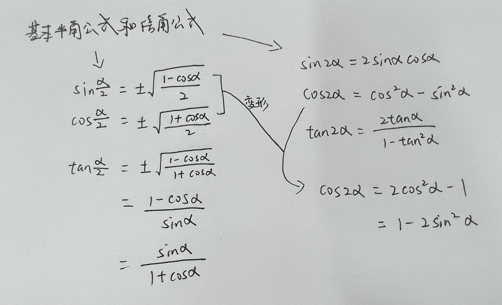

#integral

> 将本节与之前的求导公式联系起来，主要是三角函数和反三角函数的公式

不定积分基本公式
?

<!--SR:!2023-12-16,6,250-->

不定积分的基本性质
?
只有加减和 K 系数，没有乘除的拆分运算（$\int f(x)*g(x) dx$ ≠ $\int f(x)dx * \int g(x)dx$）
<!--SR:!2023-12-16,6,250-->

三角函数图像
?

<!--SR:!2023-12-17,7,250-->

各个三角函数加上 π/2 后的公式结果
?

<!--SR:!2023-12-17,7,250-->

各个三角函数减去 π/2 后的公式结果
?

<!--SR:!2023-12-18,8,250-->

三角函数求导
?

<!--SR:!2023-12-17,7,250-->

secx, cscx, cotx 转换成 cosx, sinx, tanx 分别是：
?

<!--SR:!2023-12-20,10,250-->

?

<!--SR:!2023-12-17,7,250-->

?

<!--SR:!2023-12-19,9,250-->

?

<!--SR:!2023-12-18,8,250-->

?

<!--SR:!2023-12-16,6,250-->

?
解法一
解法二

<!--SR:!2023-12-19,9,250-->

基本半角公式和倍角公式
?
补充：$sin^2α+cos^2α=1$
 [基本半角公式和倍角公式的推导](../../学习日报/Day/2023-12-07.md#基本半角公式和倍角公式的推导)
<!--SR:!2023-12-20,10,250-->

推导：$tan^2+1=sec^2x$
?

<!--SR:!2023-12-11,3,250-->

三角函数的和差角公式
?

<!--SR:!2023-12-13,3,250-->