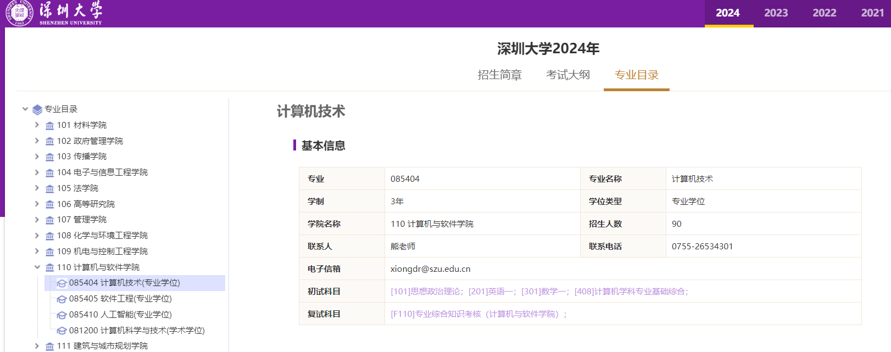
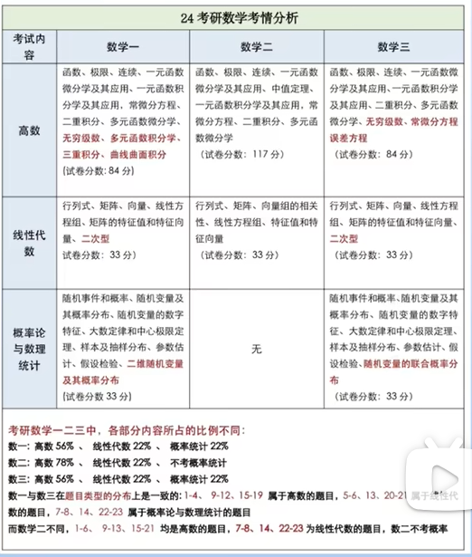
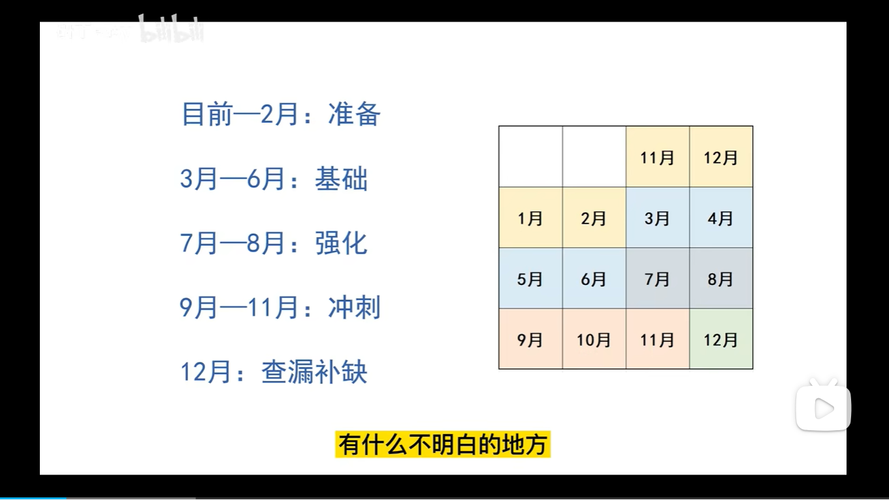

- [x] 知乎考研经验贴看完
- [x] B站看下考研前期准备视频
- [x] B站看下Notion教学
- [x] 了解一下ipad考研选购

## Notion

> Notion已经申请了教育版，但教育版现在上传单文件容量仍修改为5MB，而不是无限容量上传

- notion分享页面，可以粘贴到 https://super.so/ ，直接国内访问，当做博客，我的介绍nav3.cn导航站的教程就是这么做的。https://navdoc.super.site/ notion全端都有，方便更改。
- 如果onenote对代码块的支持不好，比如没有常用语言的高亮和任务列表（也可以通过在线高亮网站codeinword解决，OK解决不了，不能粘贴其样式），请选择obsidian的插件同步方案，notion的表格无法嵌入图片，typora和obsidian表格可嵌入图片但支持不高
- 数学政治力所能及的多点模拟题，英语、专业课不需要模拟题（强烈抗议奸商出英语专业课模拟题）。
- 强调一遍我们复习的大原则：**保证数学专业课高分的情况下，政治英语尽可能的高，因为这牵扯到时间分配。**

### 政治

>  建议复习时间 
>
> 从暑假开始复习
>
> 10月上旬-11月中旬 1.5小时/天
>
> 11月中旬-12月中旬 2小时/天
>
> 12月中旬-考试 不限时，将肖4背会为止

- **【肖秀荣精讲讲练+1000题】+【徐涛的强化版视频】是考研政治的标配。**
- 12月，肖四、肖八时政

### 数学

> 建议复习时间 3月份-考前 4小时/天

- 高数——张宇（偏重理论，适合有一定基础）
  - [高等数学](https://www.zhihu.com/search?q=高等数学&search_source=Entity&hybrid_search_source=Entity&hybrid_search_extra={"sourceType"%3A"answer"%2C"sourceId"%3A147832682})《高等数学十八讲》（[张宇](https://www.zhihu.com/search?q=张宇&search_source=Entity&hybrid_search_source=Entity&hybrid_search_extra={"sourceType"%3A"answer"%2C"sourceId"%3A147832682})）
  - 概率论《[概率论及数理统计](https://www.zhihu.com/search?q=概率论及数理统计&search_source=Entity&hybrid_search_source=Entity&hybrid_search_extra={"sourceType"%3A"answer"%2C"sourceId"%3A147832682})九讲》（张宇）
- 高数——汤家凤（偏重应试，适合小白）
  - 《考研数学复习大全》（汤家凤）
- 高数——武忠祥（适合一定基础）
- 线代王——李永乐（适合小白）
  - 李永乐660题
  - 线性代数《[线性代数辅导讲义](https://www.zhihu.com/search?q=线性代数辅导讲义&search_source=Entity&hybrid_search_source=Entity&hybrid_search_extra={"sourceType"%3A"answer"%2C"sourceId"%3A147832682})》（[李永乐](https://www.zhihu.com/search?q=李永乐&search_source=Entity&hybrid_search_source=Entity&hybrid_search_extra={"sourceType"%3A"answer"%2C"sourceId"%3A147832682})）
  - 《[考研数学全书](https://www.zhihu.com/search?q=考研数学全书&search_source=Entity&hybrid_search_source=Entity&hybrid_search_extra={"sourceType"%3A"answer"%2C"sourceId"%3A147832682})》（李永乐、王式安）
- 概率论与数理统计——王式安
- 概率论——宋浩
- 高数、线性代数、概率论——周洋鑫
- 概率论——余丙森

> 学姐，我想问一下，之前我一个直系学姐推荐我张宇高数18讲+李永乐的线代+张宇的概率8讲，我用这个代替全书差别不大吧？
>
> 完全ok的

#### 学习技巧

作者：顾不得
链接：https://www.zhihu.com/question/21068499/answer/626467936
来源：知乎
著作权归作者所有。商业转载请联系作者获得授权，非商业转载请注明出处。

**2.5 基础阶段：第三轮**

**时间投入**：8月初回校之后，还是每天花一整个早上学数学，用了一个月的时间完成第三轮复习。

**产出**：把全书的知识点全部以问题的形式摘抄到一个小本上，以后我就不拿厚重的全书来复习了，我会直接看小本，通过思考那些问题来回忆知识点，记不起来就翻书。

这个突然领悟到的方法简直好上天了。

好在哪里？因为我们直接翻看全书的时候是很舒服的，脑子不用怎么思考，**眼睛看到什么就默认已经掌握了什么，这其实有很强的欺骗性**。你可能不信，那不妨先看完一个章节的知识点，然后关上全书，拿张白纸出来，把你认为记住了的知识点全部默写下来，看看自己能写多少。我试过，跟便秘一样难受。

**而[小本子](https://www.zhihu.com/search?q=小本子&search_source=Entity&hybrid_search_source=Entity&hybrid_search_extra={"sourceType"%3A"answer"%2C"sourceId"%3A626467936})的好处在于，它让我第一眼看到的是问题，而不是答案，这样一来就能逼迫我不断思考，人一旦思考就极有可能进步**。

#### 模拟题

> 很多同学问，模拟题要不要做，这个问题其实要**具体问题具体分析**。
>
> 如果你的目标院校难度不高，数学考个110分就够了，那你就不需要看后面的内容了，全书加真题已经足够。
>
> 倘若你的目标院校难度很高，比如我考的浙大金融专硕，参考19年的情况，你起码要定135分的目标数学才能不拖后腿，那模拟题就是必不可少的一环。

**共创：**

- **优点**：出题风格贴近真题，题型难度适中，比较适合刚开始训练模拟卷的同学。
- **缺点**：试卷和答案错误很多，我当时是跟研友一起做的，所以遇到错误答案能相互讨论，基本上最后都能得出正确答案。

**李正元400题：**

- 特点是计算量大，题型比较经典，解析比较详细，但题目有点老旧

**汤家凤八套卷：**

- 比较贴近真题，但计算量会更大，解析也很详细，就是可能有些印刷错误。考试前几天我就是用它来模拟的，感觉题目质量蛮高

> 另外，考研数学最近几年有几位新的老师评价特别好，分别是擅长高数的杨超9老师与擅长概率的方浩老师。就我与很多二战的同学交流，很多一战跟了张宇的同学，二战跟了杨超和方浩，感觉完全不一样,做题上思路、方法进步很多。就考研视频课,个人是推荐高数杨超/武忠祥,线代李永乐,概率方浩/余炳森,不解释,绝对是最强的搭配之一。

### 英语

> 背单词，学语法，刷真题！
>
> 建议复习时间
>
> 3月份-8月份 3小时/天
>
> 9月份-考前 2小时/天

#### 视频

- 田静（长难句和语法）

- 石雷鹏和八哥smile（作文）
- 唐迟（阅读理解）

**无教辅，只刷真题**

### 专业课408

#### 教辅

- 王道
  - 计网
  - 操作系统
- 天勤
  - 计组
  - 数据结构

#### 视频

- 王道

​	

### 复习安排

23考研，课代表
目前—2月
‌确定专业和院校，看往年情况
‌只背单词，优先真题词汇
‌数学看看就可

3月—6月
‌买书买课买工具，找公共课历年真题（看看，不是刷题）
‌英语：单词+一两周语法+阅读解题技巧+10年前阅读真题练习
‌专业课：看书+做笔记+理解（无死角看书）
‌数学：视频+辅助刷题
‌政治：不要动！

7月—8月
‌英语：单词+长难句+10-18年阅读真题，阅读重点，其他不懂管
‌专业课：找真题+根据真题题型难度划重点+理解+刷题
‌数学：大量刷题
‌政治：每天30-60分钟

9月—11月
‌9月预报名+10月报名+10月底确定
‌英语：写作＞新题型＞翻译＞完型+近三年的阅读测试
‌专业课：背书+刷题+笔记回顾
‌政治：11月前一刷+之后背知识点，12月前之前选择题+之后分析题

12月
‌流程：25号左右初试，提前一周打印准考证
英语：写作练习+笔记回顾+单词长难句不能停
‌专业课：笔记回顾+重要知识点再背背
‌数学：继续刷模拟题+考场模拟
‌政治：直接背肖四，重点背分析题，选择题看笔记

## 日志

