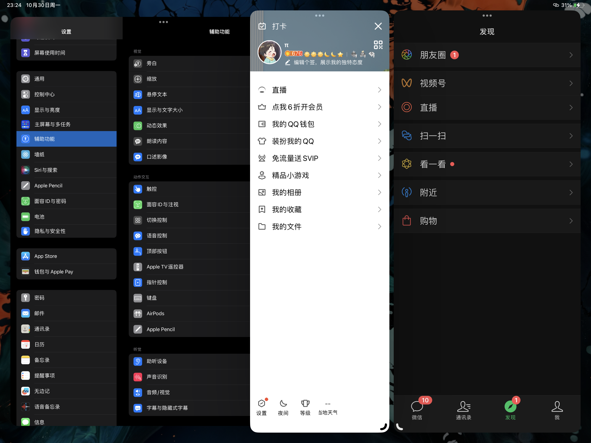

> [!blank] 
> [timeline303::timeline]

## 日志

```
Date:2023-10-30
Author:Ben

【问题】
1.
2.
3.

【解决】
1.
2.
3.

今日完成：


明日计划：


```

- 23:32 iPad 的台前调度也就是多开窗口运行，同时在 iPad 开启台前调度时，用手指从左下角和右下角滑动都无法分别触发截屏和快速备忘录，只能通过 apple pencil 触发，或者开关机+音量加键；不用台前调度只能分配至多两个应用，而通过台前调度可以分屏多个，上限取决于运行内存大小
- 23:39 即时是天气信息无法获取，Task 源码记录还是可以被 Tasks 文档所汇总
- 23:43 同时，台前调度也支持建立类似多桌面，每个桌面自定义搭配窗口运行，多桌面工作一直是 Mac 的强项，Windows 在这一方面的兼容性没有 Mac 的好


### 待看文章


### 今日任务总览

```dataviewjs
await dv.view("Taskido", {
pages: '"学习日报/Day"',
options: "todayFocus",
dailyNoteFolder: "学习日报/Day",
dailyNoteFormat: "YYYY-MM-DD",
sort: "t=>t.order",
forward: true,
dateFormat: "YYYY-MM-DD-dddd",
section: "### 今日任务",
})
```

### 未完成任务

```dataviewjs
function callout(text, type) {
    const allText = `> [!${type}]\n` + text;
    const lines = allText.split('\n');
    return lines.join('\n> ') + '\n'
}
const query = `
((created on 2023-10-30) AND (done after 2023-10-30)) OR ((created on 2023-10-30) AND (not done))
path includes 学习日报/Day
`;

dv.paragraph('```tasks\n' + query + '\n```', 'todo');
```


### 今日任务

- [x] Test 天气情况不出来，能不能记录源码的 Task ➕ 2023-10-30 📅 2023-10-30 **（可以的，本来就应该是解析源码，天气模板白天大多数时间都是可以正常调用接口获取天气信息，晚上成功率会下降很多）** ✅ 2023-11-02