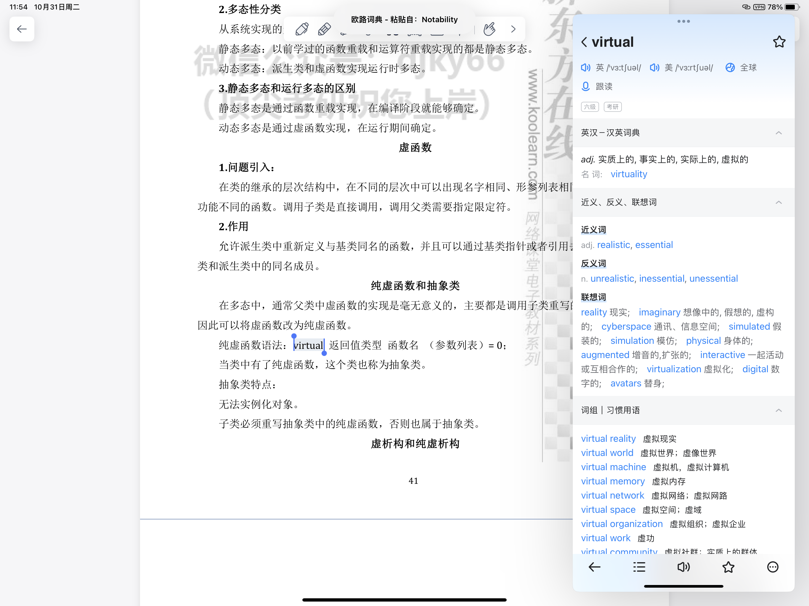

> [!blank] 
> [timeline304::timeline]

## 日志

```
Date:2023-10-31
Author:Ben

【问题】
1.
2.
3.

【解决】
1.
2.
3.

今日完成：


明日计划：


```

### MEMOS

获取不到实时天气信息是因为上游网关故障


- 09:38 目前，模板中如果天气模板信息无法实时获取导致文档下边内容无法正常渲染，直接删除天气模板即可正常显示（因为天气模板目前对我并无什么作用，只是起到一个造型上的作用，错误原因是借口上游 502 网关）

- 09:39 预览插件有个问题，就是我不方便点击图片调整换行（**也可以解决：图片不能直接被点击，但我们将光标引到图片附近，光标会变成竖杠，这时点击鼠标左键，变可以跳出图片链接了**。==OK，后面还是把 Image Toolkit 先禁用算了，确实不够方便，Mousewheel Image zoom 完全够用 ==）
- 12:00 天气模板接口刚刚创建日报时发现又好了
- 15:00 重新设置延迟时间，时间太短太磨人了总是上下晃动刷新
- 15:01 MEMOS 支持直接在输入框插入图片
- [【Obsidian卡片盒笔记法】我如何利用Obsidian实现卡片盒笔记法|高级教程|Obsidian工作流分享\_哔哩哔哩\_bilibili](https://www.bilibili.com/video/BV1om4y1R7ad/?spm_id_from=333.337.search-card.all.click&vd_source=1f9072e850dde202d6ddd4c60d9d334d) **很棒的卡片盒笔记教程！**
- 
- 
- 17:10 网状文件管理法（标签法）和树状文件管理法，两种各有各的优点，up 可能是偏设计类专业，所以才用标签管理，而我主学计算机，目前个人觉得应还是已树状管理为主 [【我最爱的Obsidian主题】如何设置Obsidian|快捷键设置|主题推荐|Minimal\_哔哩哔哩\_bilibili](https://www.bilibili.com/video/BV1Zq4y1x7Ng/?spm_id_from=pageDriver&vd_source=1f9072e850dde202d6ddd4c60d9d334d) 05:22
- up 这里其实才用视觉编辑管理归类法，比较适合我，由于学工科的原因，我的笔记风格已文本文件树状管理为主，但我个人认为我的大脑是偏向图形管理记忆类的，纯文本逻辑不是我的偏向 [【Obsidian】新版本画布如何颠覆双链笔记？MOC工作流分享\_哔哩哔哩\_bilibili](https://www.bilibili.com/video/BV1cR4y1y7Pa/?p=6&spm_id_from=pageDriver) 
- 很不错的单词记忆（基于某个 group 或同义替换）方式[在知识焦虑和All-in-one中挣扎的一些认知\_哔哩哔哩\_bilibili](https://www.bilibili.com/video/BV1M8411w754/?p=7&spm_id_from=pageDriver) 关于是否 All in one 我也在挣扎犹豫中
- ==牛逼，这是我以后会考虑转型的笔记思路==，Obsidian+官方 Canvas 画布 [【Obsidian】Canvas插件的革命性版本更新\_哔哩哔哩\_bilibili](https://www.bilibili.com/video/BV1Ws4y1j73L/?spm_id_from=pageDriver&vd_source=1f9072e850dde202d6ddd4c60d9d334d) **每一张卡片都是一个文件夹！支持嵌套！同时做了性能优化，流畅度大大提升（例如放缩界面过大，图片不显示（可调节距离显示图片资源），起到一个性能优化的作用）**
- [【Obsidian】Canvas最近个人项目分享\_哔哩哔哩\_bilibili](https://www.bilibili.com/video/BV11h411L7QZ/?spm_id_from=pageDriver&vd_source=1f9072e850dde202d6ddd4c60d9d334d) 这一章节可以学习一下，结合微信读书的插件来试点，通过白班 canvas 记录知识点主线读后感等等 

### 研究生网上确认报名时间

- 研究生网上确认报名

### 关于 iPad Pro 2018 12.9 寸的选购过程

#### 价格

- 裸机：3050💰
	- 成色 9 成新
	- 电池寿命 91%，实际毫安为 8000+，原本毫安 9000+（结果来自快捷指令的电池寿命测试）
	- 屏幕完美
	- 安兔兔跑分一百一十多万分，比 A15 芯片跑分差十万分左右而已
	- 不断触，WIFI、蓝牙完好
	- 保修 90 天
	- 小结：目前能买到的最低市场价，大捡漏（同配置的靓机价格为 4600💰（裸机））
	- Notability（切换文本模式） 与 欧陆词典联动，欧陆词典能自动识别剪切板的内容
- Apple Pencil 2 代：478💰
	- 成色 99 新
	- 小结：目前能买到的最低市场价，捡漏
- tomtoc 保护套：XX💰
	- 说明：应该是目前能找到的天花板了，特点是磁吸可拆卸，后续考虑要不要多买一个铝合金平板支架，听说 ipad 需要人体导静电
- 绿联 20W 氮化镓充电器：XX💰
	- 说明：iPad Pro 2018 款以及之后 Pro 机型都是 TypeC 充电口，所以又买了个充电器，虽说 Pro 2018 支持最高 35W 快充，但苹果官方当时发布时送的还是 18W，网上看了充电比对，充电到 94 电的时间，20W 和 35W 的时间是差不多的，只不过前期和后期的充电速度比 30W 慢（慢不少，40min 左右），不过我的预计是一天一充，晚上充电一晚，所以充电时间对我并无太大影响（快充更伤电池，目前电池循环 800+，我并无考虑换电池的想法，希望考完研后出二手，所以对电池寿命要呵护一下）


### 待看文章

- [ ] ==卡片盒笔记法这本书可以看看==，用几个标签（随堂笔记#input，闪念#fleeting，项目笔记#project，永久笔记#permanent 来进行关系图谱管理，回顾。是一个很不错是思路，然后 up 说日报之类的和专业知识点仓库分离开来，不然可能会污染，目前我保持中立状态，而且我的任务 Task 管理流已经很完善了，后续看看是否会被污染，跨平台的问题，我觉得我的 work&life 是分离的，很少需要在生活中处理工作任务，一般我只会在工作时间进行工作任务，如果真的有需要跨平台，我会选择 flomo 来进行管理日程）#read ➕ 2023-10-31 - [【Obsidian卡片盒笔记法】我如何利用Obsidian实现卡片盒笔记法|高级教程|Obsidian工作流分享\_哔哩哔哩\_bilibili](https://www.bilibili.com/video/BV1om4y1R7ad/?spm_id_from=333.337.search-card.all.click&vd_source=1f9072e850dde202d6ddd4c60d9d334d) **很棒的卡片盒笔记教程！**
- [ ] 值得反复观看的一期笔记转型视频 [【Obsidian】Canvas插件的革命性版本更新](https://www.bilibili.com/video/BV1Ws4y1j73L/?p=8&spm_id_from=pageDriver) [【Obsidian】Canvas最近个人项目分享\_哔哩哔哩\_bilibili](https://www.bilibili.com/video/BV11h411L7QZ/?spm_id_from=pageDriver&vd_source=1f9072e850dde202d6ddd4c60d9d334d)-- 2023-10-31 #read

### 今日任务总览

```dataviewjs
await dv.view("Taskido", {
pages: '"学习日报/Day"',
options: "todayFocus",
dailyNoteFolder: "学习日报/Day",
dailyNoteFormat: "YYYY-MM-DD",
sort: "t=>t.order",
forward: true,
dateFormat: "YYYY-MM-DD-dddd",
section: "### 今日任务",
})
```

### 未完成任务

```dataviewjs
function callout(text, type) {
    const allText = `> [!${type}]\n` + text;
    const lines = allText.split('\n');
    return lines.join('\n> ') + '\n'
}
const query = `
((created on 2023-10-31) AND (done after 2023-10-31)) OR ((created on 2023-10-31) AND (not done))
path includes 学习日报/Day
`;

dv.paragraph('```tasks\n' + query + '\n```', 'todo');
```


### 今日任务

- [x] 查一下 Notability 的基本用法（网上和百度网盘）以及考研常用的一些软件 ➕ 2023-10-31 📅 2023-10-31 ✅ 2023-11-14

- [x] 整理一下是否有未介绍的工作流 ➕ 2023-10-31 📅 2023-10-31 ✅ 2023-11-02

- [x] 今日单词还没背 ➕ 2023-10-31 📅 2023-10-31 ✅ 2023-11-02