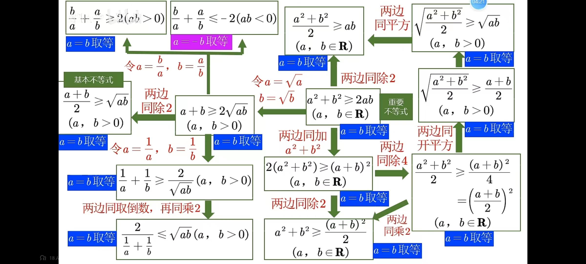

> [!blank] 
> [timeline327::timeline]

>[!blank]
> 
-----------------------------------【东莞天气😕】------------------------------------
当前温度:17℃
天气:阴
温度范围:17 ~ 28℃
湿度：91%
风向：东北风 2级
紫外线：很弱☂
空气质量：良 PM: 55🌀
日出: 06:43 日落: 17:38😴

## 日志

```
Date:2023-11-23
Author:Ben

【问题】
1.
2.
3.

【解决】
1.
2.
3.

今日完成：


明日计划：


```

### MEMOS

- 08:28 对应需要反复双链提及的块可以加入书签，方便回顾，如果非经常双链的可以直接右键生成块链接粘贴即可，这样不会污染书签列表
- 14:18 按照昨晚奕迅的陈述，408 估计没考设计模式，同时酒店需要从知道报名地点那一刻就要开始预订了

自变量的取值范围叫做 [定义域 - 维基百科](https://www.wikiwand.com/zh-cn/%E5%AE%9A%E4%B9%89%E5%9F%9F)
- 15:25 第一遍的复盘吸取的经验最多
- 17:53 给有重大考点的知识点加上其标签，方便查阅
- 18:53 百词斩有个很好的点是 使用时如果播放音乐软件歌曲，会同时降低各软件音量，并且让百词斩的播放音盖过其他音量（降低幅度比其他软件低），当退出百词斩时，音乐又会恢复正常音量（此时如果你因为降低音量而调节到更高音量时，要注意恢复音乐的振幅大小，如果你戴耳机的话）
- 20:13 自我迭代，$lim_{vault \to bug free}$ $solution \exists$
- 21:16 Obsidian中用ESC能关闭很多界面

#### 一款简易的音乐调节器

#Ben-Demo
##### 集成版

> 调节目标软件音量和其他软件的音量均衡，通过直接调节目标软件音量来实现均衡效果

##### 独立应用

> 将各软件的音量集中显示在单页面中（每个软件拥有单独的声道方便调节）

目前的初心只是调整音量的大小，不涉及其他都音效

#不等式公式


### 待看文章


### 今日任务总览

```dataviewjs
await dv.view("Taskido", {
pages: '"学习日报/Day"',
options: "todayFocus",
dailyNoteFolder: "学习日报/Day",
dailyNoteFormat: "YYYY-MM-DD",
sort: "t=>t.order",
forward: true,
dateFormat: "YYYY-MM-DD-dddd",
section: "### 今日任务",
})
```

### 未完成任务

```dataviewjs
function callout(text, type) {
    const allText = `> [!${type}]\n` + text;
    const lines = allText.split('\n');
    return lines.join('\n> ') + '\n'
}
const query = `
((created on 2023-11-23) AND (done after 2023-11-23)) OR ((created on 2023-11-23) AND (not done))
path includes 学习日报/Day
`;

dv.paragraph('```tasks\n' + query + '\n```', 'todo');
```


### 今日任务
