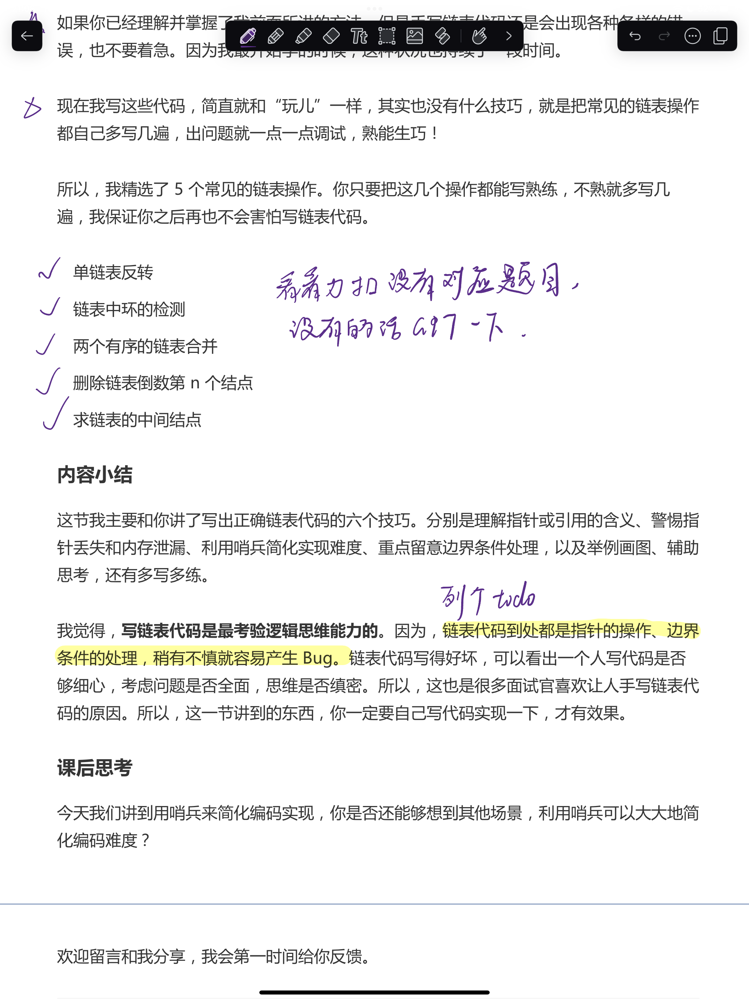

> [!blank] 
> [timeline331::timeline]

>[!blank]
> 
-----------------------------------【东莞天气😕】------------------------------------
当前温度:18℃
天气:晴
温度范围:17 ~ 27℃
湿度：84%
风向：东北风 2级
紫外线：弱☂
空气质量：良 PM: 50🌀
日出: 06:45 日落: 17:38😴

## 日志

```
Date:2023-11-27
Author:Ben

【问题】
1.
2.
3.

【解决】
1.
2.
3.

今日完成：


明日计划：


```

### MEMOS

- [ ] 考研自习室（带住宿可以看看网上怎么评论的），今晚回去可以了解一下，如果到时候学校不让进来备考，留一条后路（看看广州和潮州有没有（美团、小红书、抖音都找找，**能在广州大学城店最好！** 熟悉熟悉大学城环境），东莞暂不优先考虑，除非是学校及附近） ⏫ 📅 2023-12-03

- 09:40 求导（是否可导），看某点附近的极限值是否存在，中学时期是求某点上的斜率，这种做法精确度还不够，大学求的是某点附近一小段的斜率
- 10:00 好东西
- 15:05 其实可以发现，学数学跟写代码是一样的，最重要的思想、只要能够找到、理清解题思路，写解题步骤就是苦力活的事情，学编程也是如此，当你知道要用哪种算法进行解答或重构优化代码找到了合适的方案，写代码实现这一过程就是做苦力的时候。所以学习一门学科，最重要的是多花时间在理论基础上，将它的思想融会贯通，这样无论解决怎样的场景问题，都能快速上手，做到游刃有余
- 15:35 现在写解题步骤有一个问题是，知道思路大致如何，但有时候会写漏条件，要多练
- 15:43 现阶段的 anki 制作已经很偷懒了，直接 copy 和 paste，你要知道写复杂的 markdown 数学语法对你的提升可忽略不计
- 16:39 层次不同讨论问题的高度不同（喜度），但要学会向下兼容
- 14:52 anki卡片加 --- 也能构造分割，将答案区进行分区 ^6trp0b

#### 隐函数求导中，$(y^2)'$ 为什么等于 $2y\frac{dy}{dx}$

这里 y 是关于 x 的隐函数，所以我们可以将 y 看成函数来求解，则 y^2 相当于幂函数与 y 函数组成的复合函数，故 $(y^2)'$ = 2y · y' = $2y\frac{dy}{dx}$

- [ ] 链表-算法题

- [ ] 寒假回潮的话，要看看姑姑家的摩托车有没有用，开车去图书馆

### 待看文章


### 今日任务总览

```dataviewjs
await dv.view("Taskido", {
pages: '"学习日报/Day"',
options: "todayFocus",
dailyNoteFolder: "学习日报/Day",
dailyNoteFormat: "YYYY-MM-DD",
sort: "t=>t.order",
forward: true,
dateFormat: "YYYY-MM-DD-dddd",
section: "### 今日任务",
})
```

### 未完成任务

```dataviewjs
function callout(text, type) {
    const allText = `> [!${type}]\n` + text;
    const lines = allText.split('\n');
    return lines.join('\n> ') + '\n'
}
const query = `
((created on 2023-11-27) AND (done after 2023-11-27)) OR ((created on 2023-11-27) AND (not done))
path includes 学习日报/Day
`;

dv.paragraph('```tasks\n' + query + '\n```', 'todo');
```


### 今日任务
