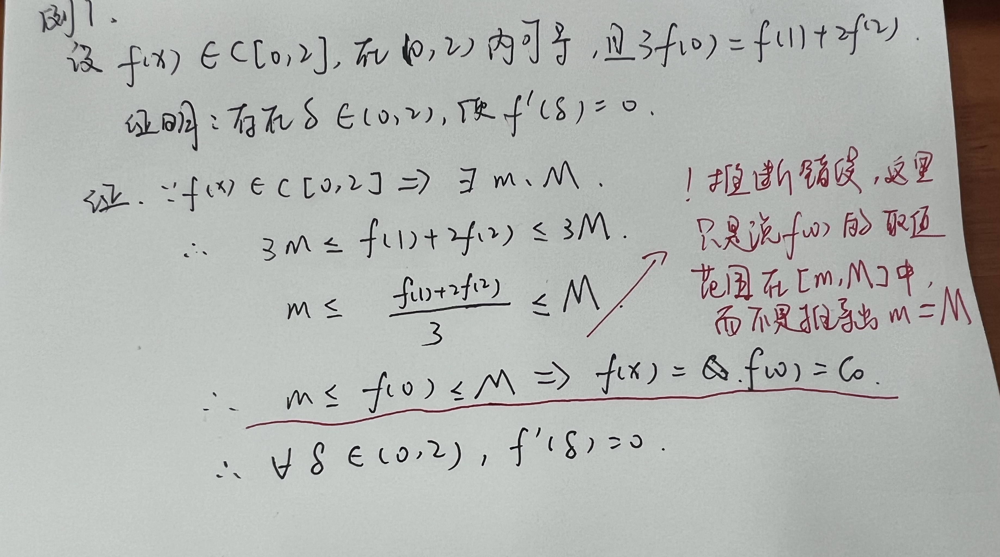

> [!blank] 
> [timeline336::timeline]

>[!blank]
> 
-----------------------------------【东莞天气😕】------------------------------------
当前温度:15℃
天气:阴
温度范围:14 ~ 19℃
湿度：63%
风向：东北风 3级
紫外线：很弱☂
空气质量：优 PM: 26🌀
日出: 06:49 日落: 17:38😴

## 日志

```
Date:2023-12-02
Author:Ben

【问题】
1.
2.
3.

【解决】
1.
2.
3.

今日完成：


明日计划：


```

### MEMOS
- 08:56 一些格式可能在编辑预览模式下没有被渲染，切换成预览模式就有了
- 17:32 没想到居然会犯题目抄错解不出问题的乌龙。。。
- 17:55 没救了，这傻小子

#### y=ax+b 是 y=f(x)的斜渐近线，为什么 lim_{x->∞}f(x)/x=a（a≠0，∞）呢？


#### 推断错误

今天犯了一个比较致命的推断错误


### 待看文章


### 今日任务总览

```dataviewjs
await dv.view("Taskido", {
pages: '"学习日报/Day"',
options: "todayFocus",
dailyNoteFolder: "学习日报/Day",
dailyNoteFormat: "YYYY-MM-DD",
sort: "t=>t.order",
forward: true,
dateFormat: "YYYY-MM-DD-dddd",
section: "### 今日任务",
})
```

### 未完成任务

```dataviewjs
function callout(text, type) {
    const allText = `> [!${type}]\n` + text;
    const lines = allText.split('\n');
    return lines.join('\n> ') + '\n'
}
const query = `
((created on 2023-12-02) AND (done after 2023-12-02)) OR ((created on 2023-12-02) AND (not done))
path includes 学习日报/Day
`;

dv.paragraph('```tasks\n' + query + '\n```', 'todo');
```


### 今日任务
