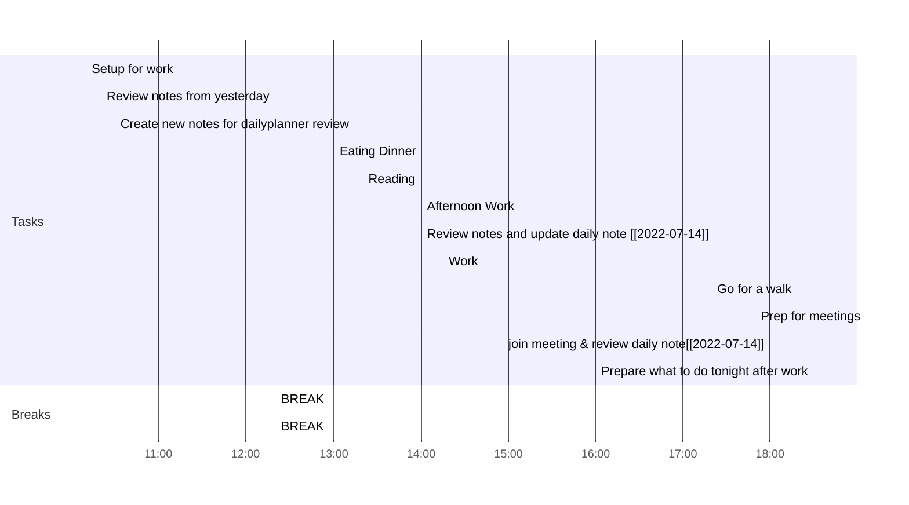

> Obsidian 中修改顶部的一级标题即修改文件名（重命名），同时 Obsidian 默认为自动保存，目前单文件书写量接近一万字，仍无卡顿出现，还不错

<br />

## 扩展配置

> 有以下两款应用的加持搭配第三方依赖，Obsidian 的效率将进一步提升
> 
> 扩展配置建议设置开机自动启动

<br />

### MouseInc

> 自定义专属 Obsidian 的特定手势动作

<center><strong>Obsidian</strong></center>


 <center><strong>浏览器</strong></center>


<center><strong>Chrome</strong></center>


<center><strong>vscode</strong></center>


### aText

> 智能补全，可以帮我快速实现快捷键等特定功能


### uTools

[uTools官网 - 新一代效率工具平台](https://www.u.tools/)

通过 `Alt+空格` 呼出搜索框，目前主要用来**快速搜索网页**，减去先打开谷歌浏览器的这一操作（==补充：和查找本地应用或文件/文件夹==），当然你也可以根据自己  `网页快开` 中自定义的网页，先打出他们的标签名再搜索内容，那么就是在谷歌浏览器中先打开该官网，并且在该官网中搜索内容（后面的搜索内容相当于 url 后面的 query 参数）


本地搜索是基于 everything 软件进行搜索的，可通过先输入 find 标签页，可不写。


	
### 网易有道词典

> uTools 上的易翻词典用不惯，免费的谷歌翻译网太慢了，索性直接设置有道的 mini 窗口（可钉住）快捷键启动 `Alt+A`，更改微信的截图快捷键先，不然热键冲突，同时关闭 mini 窗口也是 `Alt+A`
> 
> 最常用的是截图翻译

### 鼠标外设

> 拥有 11 个自定义编程键的雷蛇 v2 和罗技 G502Hero，大大提升我的工作效率

图 1 雷蛇 v2

图 2 罗技 G502Hero

### Snipaste

> 一款可标注可贴图的截图软件

#### 常用快捷键说明

- `F1` ：启动截图
	- `Ctrl+C` ：快速复制截图
- `F3` ：贴图/恢复贴图
- `space` ：空格启动编辑视图
- 鼠标滚轮可缩放贴图大小
- 鼠标左键双击贴图为关闭贴图

## Edit

> Obsidian 的配置存储在根目录下的 `.obsidian` 目录中，快速配置另一个仓库的 Obsidian 插件信息的话直接复制粘贴过去即可

<br />

### 双链

#### 文档附件统一存放指定文件夹


Wiki 链接普通的 markdown 编辑器（例如 typora）无法识别，同时我们需要将文档中的附件放到一个静态资源文件夹中，因为 Obsidian 无法向 Typora 中一个文档对于一个图片文件夹，所以我们设置一个文件夹对于一个 asset 静态统一存放的文件夹

<br />

### 编辑/预览模式

> Obsidian 不像 typora，实时预览模式目前尚有欠缺
> 
> 引用字段下面的内容多段换行无效，换行加 Tab 无效，需要用 `<br />` 来控制换行
> 
> `<br />` 主要对下行文字有影响，需要换行两次，不然下一行如果是标题将以 markdown 源码的形式展示

<br />


#### 外观

- 将大纲视图从右侧移动到左侧，右上方现在主要展示日历，右下方是 MEMOS
	- 
- 扩展 ben.css 文件
- 打开核心插件：工作区布局管理
	- 
- Obsidian 开启透明效果，拖拽窗口会延迟卡顿，跟 electron 底层实现有关系

#### 打开标签页方式

无论阅读视图还是编辑视图中，打开当前文档中的双链方式：

- `鼠标左键`：在当前标签页跳转链接
- `Ctrl+鼠标左键`：打开链接到新标签页（tab）
- `Ctrl+Alt+鼠标左键`：打开链接到新面板（pane）
- `Ctrl+Shift+Alt+鼠标左键`：打开链接到新窗口（window）
- 鼠标右键点击链接也可选择

<br />

### 快捷键绑定

> `Obsidian` 的快捷键都能在 `设置` 中自定义绑定

<br />

#### 常用快捷键（&自定义）

- `Alt+Z` ：打开/创建今日日记
- `Alt+X` ：打开 `Tasks` 汇集文档（待办事项）
- `Alt+C` ：打开 `read` 汇集文档（待看文章）
- `Alt+V` ：创建任务（注：需要在每项任务列表中添加任务创建时间才能在周报中展示任务）
- `Ctrl+O` ：快速切换文件
- `Ctrl+P` ：打开命令面板
- `Ctrl+E` ：切换编辑/预览模式
- `Ctrl+R` ：使用系统默认应用打开（这里设置 `Typora` 为默认打开 `.md` 格式应用）
- `Ctrl+J` ：打开大纲（MouseInc 手势）
- `Ctrl+H` ：查找并替换
- `Ctrl+Shift+I` ：打开控制台
- `Ctrl+,` ：打开设置
- `Ctrl+G` ：打开全局关系图谱
- `Ctrl+Shift+G` ：打开局部关系图谱
- `Ctrl+K` ：插入链接（现有 `Auto Link Title` 插件代替，直接粘贴即链接格式）
- `Ctrl+Shift+L` ：打开文件列表（MouseInc 手势）
- `Ctrl+M` ：打开当前文档 Mind Map 思维导图
- `Ctrl+L` ：切换高亮

<br />

### Obsidian Git

> 首先需要你当前文件夹已经有 `.git` 文件，与远程仓库进行绑定，`obsidian git` 会根据你所设置的时间间隔当文件内容发生改变时，定时提交并推送到远程，提交的信息由你设定（默认是采用时间变量等上传信息）


​	

### Easy Typing

> 简化 Obsidian 中的书写，自动格式化插件自定义文本格式

- 单回车自定义编辑为双回车（**已舍弃**，Obsidian 和 Typora 的设计理念不同，Typora 自带双换行，更方便用户排版，轻量化；Obsidian 则是希望用户对 markdown 进行完美控制，严格按照 markdown 原生单换行进行）
	- 
- 输入数字、英文、中文之间增加空格
- 当前行首字母大写

#### Bug

- Easy Typing 对 win10 自带的微软拼音不兼容，容易造成输入重复的问题，win11 的微软输入法得以改善，but 我现在是 win10 系统，其他输入法没有此问题，比如正在用的百度输入法
- 百度输入法默认设置中文输入法符号补全，例如（），导致光标调到了（）之后，需要方向键调回，这很不优雅，所以在百度输入法的设置中选择关闭

	

### Various Complements

> 智能补全插件，可以自己设置一个字典 `conf/word.md` 的文件放到插件配置中（例如一些专业名词等），目前前期用不到这个，先禁用

​	

### QuickAdd

#### 问题

- quickadd 的参数变量不清楚有哪些（需网上自行查找，[点击这里](https://momentjs.com/docs/#/displaying/format/)），导致 `Template` 目录下的模板文件并不完美 （**已解决**）
- 由于模板创建文件会导致非 Wiki 链接失效（因为文件地址各不相同，所以有的会打不开），这里还是使用 Wiki 本身本身链接来点击跳转，不过这样的话 Typora 等等其他 markdown 编辑器就看不到文档的附件了（算了，觉得还是不能舍弃，还是放弃 Wiki 专属链接好了）
- 一个设计小缺陷，quickadd 创建新文件时如果涉及变量（例如 `name`、`value`等）创建新文件会在文档中自动打印文件名，通过 tp.file.title 已经可以控制要打印的内容和格式（比如 markdown 给 tp.file.title 加一级标题了），所以对我而言，quickadd 自动打印文件名到文档这一行为是不必要的，但作者又没有设置选项可以控制关闭它😐


> QuickAdd 最好用的是 capture 和 template，可通过 `Ctrl+D` 执行文件命令
> 下面介绍我自定义的几种用法：

#### Capture 捕获

1. ✏Capture write，主要用于记录即时灵感或未来要输出的文章标题


2. 😍Begin write，主要是基于 ✏Capture write 书写待编写的文章


3. 🍰Ready to read，主要通过 tasks 收集日报中待看文章标题下的任务列表（通过标签 `#read` 来收集），用于记录自己待看文章和已读文章，待看文章的任务可以散落在各个日报中


> capture format ：`[{{value}}](url) -- {{DATE:}} #read`

为什么会有这个待看文章汇总的使用场景？

> 因为之前学前端的时候，观看官方文档，一篇知识点文章往往能牵扯出其他知识点，并且这些知识点都是需要你掌握的，所以待看文章越增越多，导致文章看了好几天，也散落在各个日报中，偶尔会漏看文章，或者我把文章记录到某一篇日报中，而当我关机重启或者关闭该日报所在的 markdown 编辑器再重新打开时，我会不知道待看文章的汇总在哪一篇日报中，需要我一个个去找，这显然是低效率的，而有了 tasks 汇总后我可以随心记录待看文章，因为它会帮我系统的汇总（查询排序的语句是用户（我）自定义的）

> 暂定将待看文章系统的排序整理是在日报中手动整理（缩进，优先级前后，递进关系等等），[read](../Pub/Capture/read.md) 只能起到汇总，如果要整理排序汇总，查询语句可能较复杂（反正我暂时不会也不想学 2023-10-25）

4. 🤪Immediate Todo，快速在当天日报的 `### 今日任务` 下生成 todo，但目前已经有 tasks 自定义快捷键 `Alt+V` 生成带日期的插件和也可以 `Alt+Z` 打开当天日报手动定位，所以 quickadd 的 🤪Immediate Todo 会用得比较少，适合纯文本的任务记录
5. 🦢Anki Anki，是类似 Anki 卡片的快速背诵，通过 [Obsidian工作流--Spaced Repetition](学习日报/Obsidian工作流.md#Spaced%20Repetition) 插件来实现，语法请查考：[卡片Demo](../Pub/Flashcards/卡片Demo.md)，这一 capture 可以帮助我们快速记录想闪念背诵的东西，并可通过命令面板来做相应其操作（快捷键就不设了，太多了）

<br />

#### Template 模板

5. 🌱Record daily，主要用于生成日报，同时在核心插件-日记也进行了配置，用哪个插件都行，后续可以用左侧核心插件-日记进行当天日报的跳转，或者是在 Calendar 插件显示的右侧日历，基于点击的日期跳转到指定日报文件（可以是当天也可以是其他天数，未创建时会询问是否创建）


6. 🌳Record weekly，记录周报，通过它能快速生成当周周报模板


7. 🤔PDF Annotator，基于 Annotator 插件来快速创建 PDF 注释文档模板，使我能编辑记录指定 PDF 的内容和笔记

> Annotator，一款比 Obsidian 自带 PDF 阅读器更强大的注释阅读器（插件），下面有介绍具体介绍 [Annotator](#Annotator)  插件


### Tasks

 > 增强版的任务列表，可以快速配置开始时间、截止时间等，搭配 dataview 插件和 Memos 插件使用
 > 
 > 快捷创建任务：`Alt+C`
 > 输入任务内容后单空格能选择各类时间（开始、计划开始、截止时间等）或者触发关键字 `created`、`today`、`monday`等
 > 
> Tasks 的查询管理任务列表查看文件 [Tasks](../Pub/Capture/Tasks.md)（这个很有用，我可以把 tasks 散落在各地，只需要一个文档用 tasks 语法进行汇总就好了，直观清晰， Tasks 还有循环重复的功能，任务完成后在规定时间内可再次生成一个一模一样的 tasks，使用场景比如现实生活中定期发生的事情，发工资或提醒 XX 事情等等）
    Tasks Queries 查询语句，请前往文档 [这里](https://publish.obsidian.md/tasks/Queries/Sorting#Sorting)

在这里补充一点：

[Tasks](../Pub/Capture/Tasks.md) 中已完成标题下的排序除了用 `sort by path reverse` 还可以用 `sort by done`

未排程 Tasks 语法查询语句：

```txt
not done
no due date
description does not include #read
sort by path reverse
```

<br />

### Dataview

> Dataview 可以通过 JS 脚本收集各类数据（例如收集标签、某段时间间隔的所有文档等）进行排序汇总，而 dataviewjs 处理脚本往往涉及变量，需要 templater 插件来识别 <% %> 包裹的变量并进行展示

一定要打开 JavaScript Queries


> **讲一下 Tasks 跟 dataview 的区别**
> 
> Tasks 主要是用来汇集各个文档的任务列表部分，dataview 是用来汇集各个文档
> 当然了，Tasks 能做的事情，dataview 也能完成

#### [日记模板](../Pub/Template/日记模板.md)

解释一下 Taskido 中的 forward: true，forward 设置为 true，会把其他任务放到当天显示（点击可定位回去存放该任务的文档中），设置为 false 的话，虽然不在当天日报显示具体内容了，但任务总览里依然会显示 due（已过期） 的数量

日报中的月份刻度显示当前日报位置，需要额外导入 css 文件，第三方导入 css 文件可覆盖 Obsidian 原生 css 样式


目前我所设置的自定义样式 `ben.css` 只包含对预览/编辑模式-加粗样式的调整，后续会持续更新（***已更新***），代码如下：

```css
/* 更改加粗样式 */
.cm-strong {
  font-weight: bold;
  color: #fff !important;
  background-color: #2ea44f;
  border-radius: 6px;
  line-height: 1.7;
  padding: 2.5px 8px;
  margin: 0px 5px;
}
strong {

  font-weight: bold;
  color: #fff !important;
  background-color: #2ea44f;
  border-radius: 6px;
  line-height: 1.7;
  padding: 2.5px 8px;
  margin: 0px 5px;
}

/* 使图片居中显示并设置圆角 */
img {
  border-radius: 30px;
}
.internal-embed.media-embed.image-embed.is-loaded {
  text-align: center;
}

/* 修改默认主题的背景样式 压缩图片+转化base64格式*/
body {
  background-image: url(base64); /* 这里base64值太长，就省略了*/
  background-size: cover;
  opacity: 0.89; /* 这个透明度对我来说目前刚好 */
}

/* 给标签页添加选中过渡动画和修改选中背景色 */
.workspace-tab-header {
  transition: box-shadow 0.2s ease-in-out, color 0.2s ease-in-out, background-color 0.2s ease-in-out; /* 添加过渡动画 */
}
.workspace-tab-header.is-active {
  background-color: #000000; /* 选中时的颜色 */
}
```

> 下面代码为原作者未完成任务的数据汇集代码，我的日记模板则删除了 hide 的部分

```html
### 未完成任务

```dataviewjs
function callout(text, type) {
    const allText = `> [!${type}]\n` + text;
    const lines = allText.split('\n');
    return lines.join('\n> ') + '\n'
}
const query = `
((created on {{DATE:YYYY-MM-DD}}) AND (done after {{DATE:YYYY-MM-DD}})) OR ((created on {{DATE:YYYY-MM-DD}}) AND (not done))
path includes 学习日报/Day

hide backlink
hide created date
`;
```

#### [周记模板](../Pub/Template/周记模板.md)

> 无论日记模板还是周记模板，使用下面代码收集记录 `未完成任务` 都需要带上创建时间

```dataviewjs
function callout(text, type) {
    const allText = `> [!${type}]\n` + text;
    const lines = allText.split('\n');
    return lines.join('\n> ') + '\n'
}
const query = `
((created on 2023-10-25) AND (done after 2023-10-25)) OR ((created on 2023-10-25) AND (not done))
path includes 学习日报/Day

hide backlink
hide created date
`;

dv.paragraph('```tasks\n' + query + '\n```', 'todo');
```
> 下面代码为原作者 `任务总结` 的数据汇集代码，我的周记模板则删除了 hide 的部分

```txt
## 任务总结

### 本周已完成

```dataviewjs
function callout(text, type) {
    const allText = `> [!${type}]\n` + text;
    const lines = allText.split('\n');
    return lines.join('\n> ') + '\n'
}

const query = `
created (before, after) <% tp.date.weekday("YYYY-MM-DD", 0) %> <% tp.date.weekday("YYYY-MM-DD", 6) %>
done (before, after) <% tp.date.weekday("YYYY-MM-DD", 0) %> <% tp.date.weekday("YYYY-MM-DD", 6) %>
path includes 学习日报/Day
group by created
hide backlink
hide created date
hide due date
hide start date
`;

dv.paragraph('```tasks\n' + query + '\n```', 'done');

--------------------------------------------

### 本周未完成

```dataviewjs
function callout(text, type) {
    const allText = `> [!${type}]\n` + text;
    const lines = allText.split('\n');
    return lines.join('\n> ') + '\n'
}

const query = `
created (before, after) <% tp.date.weekday("YYYY-MM-DD", 0) %> <% tp.date.weekday("YYYY-MM-DD", 6) %>
((done after <% tp.date.weekday("YYYY-MM-DD", 7) %>) OR (not done))

path includes 学习日报/Day
group by created
hide backlink
hide created date
hide due date
hide start date
`;

dv.paragraph('```tasks\n' + query + '\n```', 'todo');
```

#### 阅读书库

> 设想：利用 dataview 汇总 `PDF-Annotate` 的读书笔记文档到 `阅读书库` 目录下创建的 `书评.md` 进行汇总排序


> 可以用清单的形式展现，也可以用表格展示更多维度的信息


<br />

### templater

> 目前我只用它**识别和展示** <% %> 包裹的变量，完成 dataviewjs 事件
> 
> 但它也可以用来插入指定的文件模板，跟 Obsidian 核心插件 `模板` 是差不多的
> 它可以给指定文件夹绑定指定模板，使用文件夹下创建的文件统一使用统一模板管理，

> [Johnny学OB 第45集 分享OB必用插件Templater的两个懒人用法，看不懂没关系，放到模板下面就可以用\_哔哩哔哩\_bilibili](https://www.bilibili.com/video/BV1RR4y1x7S8/?spm_id_from=333.788.recommend_more_video.-1&vd_source=1f9072e850dde202d6ddd4c60d9d334d)
> 
> 演示代码：[Airtable - Grid view](https://airtable.com/app3mrMDDf1UIQeUB/shrqmxUIfUg8Y0ca8/tblpzHoW1lmd2FSGk)

```txt
1. 将使用当前模板创建的笔记，自动移动到制定文件夹，如果文件没有提前命名,则弹出命名窗口
把这个代码片段放到任何模板的后面，使用时讲“目标文件夹"修改成你想要制定的文件夹

<% await tp.file.move("/目标文件夹/" + ((tp.file.title.includes("未命名") || tp.file.title.toLowerCase().includes("untitled"))  ? (await tp.system.prompt("请输入要创建的文件名")) : tp.file.title)) %>

---

2. 使用Templater新建文件时，自动加上当前所在的文件夹名称

<% await tp.file.rename(tp.file.path(true).split('/')[tp.file.path(true).split('/').length-2] + " " + ((tp.file.title.includes("未命名") || tp.file.title.toLowerCase().includes("untitled")) ? (await tp.system.prompt("请输入要创建的文件名")) : tp.file.title)) %>
```

#### Bug

- 发现 templater 插件和 Obsidian 有时不能实时渲染的问题，提示 templater 解析失败，实际上是因为没有联网的原因（因为日报里的天气模板信息是调取天气网页接口获取当天实时天气信息的），需要联网后才能实时渲染 ^1nb0af

<br />

### Memos

> 类似 iPhone 的 `提醒`，它可以设置在当天日报的指定标题下同步 `提醒` 的内容
> 目前我暂时打算只当**即时灵感记录和提醒列表**来用，任务列表已经有 `Tasks` 插件了

> 它的优点是集成在工作区界面，可以让我第一时间记录即时灵感，脱离打开指定文件的步骤并节省其时间

<br />


有点类似 github 的贴砖记录图，点击 MEMO 😉 能返回首页


> MEMOS 删除的任务列表在这里→ [delete](Day/delete.md)

<br />

### Calendar

> 一款日历插件，插件默认在右上方展示，点击日期会跳转到该日期对应的日报，如果日报未创建会弹出是否进行创建，一般创建日报对应日期下方会有白点小标志，直观清晰 


### Hypothes.is

> 分享 `网页标注` 文章阅读心得，通过浏览器插件 `Hypothesis` 进行网页标注，高亮或注释某一段文章或语句等，并在语句下方进行评论，Obsidian 端下载 Hypothes.is 插件并绑定你的账号 token，设置好同步拉取时间，Obsidian 会定时拉取你在浏览器标注的网页内容和评论到指定文件夹（我指定在 `Pub/Hypo` 目录下，将拉取内容生成文档放到此目录中），然后一般评论我会以任务列表的形式并在任务描述后面加上 `#share` 标签，这样我在 Obsidian 中的 writing 文件设置 tasks 收集带`#share` 标签的任务，可以让我更方便的回顾网页标注的内容、访问原网页和写心得，减少像放到收藏夹吃灰的现象，打通输入（看的信息，例如资讯等）输出（写心得、文章、重新思考的过程）

下面是插件配置格式：

```

# {{title}}

## Metadata
- Author: [{{author}}]({{authorUrl}})
- Title: {{title}}
- Reference: {{url}}
- Category: #article



## Page Notes

{{highlight.annotation}}

Tags:  #{{tag | replace(" ", "-")+" "}}





## Highlights

- {{highlight.text}} — [Updated on {{highlight.updated}}]({{highlight.incontext}})
 — Group: #{{highlight.group | replace(" ", "-")}}
    - Tags:  #{{tag | replace(" ", "-")+" "}}

   
- Annotation:
{{highlight.annotation}}


```


> 当然了，你也可以在命令面板或者左侧栏同步标志手动执行同步


### [ObWeb](https://github.com/chenyukang/obweb)

> chenyukang 作者研究的一款 Obsidian 移动端同步自动化开源项目，但对我目前来说，关系不大，先跳过

<br />

### cMenu

> 一个快捷工具栏，方便阅读时只使用鼠标操作，尽量不用键盘，提升阅读体验
> 自定义：新增行数和增加高亮，方便下面 Spaced Repetition 插件制作 Anki 卡片


### Auto Link Title

> 自动插入链接和标题的插件，Obsidian 自带的插入链接不好用，无法识别剪切板内容并粘贴链接，这一插件能直接通过粘贴来插入链接的同时，读取链接的第一级标题，并填充到说明文字中，上面的 ObWeb 标题链接则是通过这一插件来完成的

<br />

### 幻灯片

> Obsidian 自带的核心插件，可以将文档当成幻灯片讲解，通过 `---` 分割每一页幻灯片


<br />

### Automatically Reveal Active File

> Obsidian 的索引有一个小缺陷，就是切换文件的时候（例如 `Ctrl+O`）大纲无法精准定位（虽然 已经 高亮 到新文件了，但无法展示被文件夹隐藏的文件，需要手动打开才能看到，同时如果目标文件超过大纲当前视图区域，也需要你手动去找目标文件，这样很不优雅，`Automatically Reveal Active File` 可以快速定位并高亮目标文件）

#### Bug

>  `Automatically Reveal Active File` 高亮定位插件跟 `Remember cursor position` 保存光标定位插件冲突，根据自身需求，我暂时先选择后者插件

<br />

### Remember cursor position

> 通过保存文档滚动条高度以及光标位置来保存当前文档观看进度，以便切换文件的时候文档不会从头开始，同时文档位置信息保存在本地插件目录中，即使关闭 Obsidian 编辑器，下次打开该文档，依然会跳转到当前观看进度

#### Bug

> 发现一个小 Bug，虽然 `Remember cursor position` 会本地化保存文档进度（也就是关闭编辑器打开仍然是跳转到上一次编辑的进度），但是由于 Obsidian 本身的机制，打开 Obsidian 默认是打开上次编辑文件的位置（估计源代码是默认从头开始展示，因为它自身也没有保存文档观看进度的功能，这是第三方插件集成的功能）
> 
> 所以，你需要 Obsidian 默认打开的是你的目标文档，需要先点击其他文档，再点击回你的目标文档，才能跳转到上次观看进度的位置，这个有点小不方便


<br />

### Better Command Palette

> 增强的命令面板，我暂时不需要


<br />

### Hotkeys for specific files

> 实现为指定文件绑定快捷键打开


> Tasks 文档是我每天必看的（看看有什么任务没完成），所以在这里添加打开操作的快捷键


<br />

### Excalidraw

> 一个手绘风格的绘画插件
> 
> 新版本更新缺少 `main.js` 文件无法启动，需要去 github 主页的 release 下载


<br />

### Map Mind

> 根据当前 markdown 的大纲视图生成思维导图的工具
> 
> 自定义快捷打开：`Ctrl+M`

<br />

### Stack tab groups 堆栈选项卡组

> 您可以堆叠选项卡以将其滑动到同一选项卡组中的其他选项卡上。若要堆叠笔记，请选择选项卡组右上角的向下箭头，然后选择 堆叠笔记。


<br />

### Day Planner

> 简易教学：[用Obsidian+Day Planner做日程管理\_哔哩哔哩\_bilibili](https://www.bilibili.com/video/BV1t14y1P7Rv/?spm_id_from=333.337.search-card.all.click&vd_source=1f9072e850dde202d6ddd4c60d9d334d)
> 
> 记录日程安排，在侧边栏中会生成纵向时间线，文档顶部还会生成甘特图，当设置时间到来时，它会调用系统自带的通知


#### 讲一下目前 Day Planner 的现状和看法

相对于竖屏的 Timeline 我更喜欢甘特图这一个进度显示的，同时设置中原本能根据进度调用系统的通知来提醒进入下一阶段任务，搭配日报 template，多美妙的想法！但后期作者已经删除了甘特图同时通知也失效了，很遗憾，可能是 bug 太多了，所以我决定还是关闭 day planner 插件的使用，它于我而言只是锦上添花的作用

- [GitHub - ivan-lednev/obsidian-day-planner: An Obsidian plugin for day planning and managing pomodoro timers from a task list in a Markdown note.](https://github.com/ivan-lednev/obsidian-day-planner)
- 
- [更新到1.0后，第三方插件DayPlanner甘特图的条状图变透明 - 疑问解答 - Obsidian 中文论坛](https://forum-zh.obsidian.md/t/topic/11830/3)
- [你真的需要Day Planner吗? - 经验分享 - Obsidian 中文论坛](https://forum-zh.obsidian.md/t/topic/297)

<br />


### Kanban

> 简易教学：[看板插件（Kanba插件介绍） | 软通达](https://cyddgh.github.io/post/202104222356/)
> 
> 看板插件能更直观的地管理项目工程，添加卡片、移动卡片、完成卡片、插入图片，同时也能使用双链和其他文档进行联动，例如设置 30 天后的任务，日志面板会在 30 天会有一个任务记录

[2023-11-01](学习日报/Day/2023-11-01.md#^38sksi)

<br />


### 读书笔记

#深度阅读 #PDF批注 #串联笔记

#### Annotator

> 一款 支持本地和在线的 PDF 以及 Epub 的阅读注释器

##### 语法

```txt
---
annotation-target: 本地附件链接/在线链接
type: pdf/epub
---
```

> 以上语法设置了 `quickadd` 的 template，修改了 Annotator 创建文件时默认用 markdown 形式打开而不是 annotate，只需要再填充 url 然后点击右上角 `···` 的 annotate 打开即可
> 
> **需求**：我希望能在模板中创建一个 url 变量，再 quickadd 创建模板文件的时候，除了自定义名字还能自定义 url 地址，这样的话我就可以直接默认 annotate 模式打开了，减少繁琐步骤
> **解决**：之前以为 value 值只能是标题的值，没想到只需要在模板中设置 `{{VALUE:自定义输入文字}}` 即可创建多个 value 值并在使用 quickadd 创建文件的时候提前自定义好 各个 value 值

^j0cbvb

点击 Annotations 注释还能跳转到标注时的位置并高亮


> 在阅读模式下，可以清楚的看到在该附件（PDF）中标注了哪些内容和记下哪些笔记，同时可以双向链接其他文档


> 小结：Annotator 插件确实也不错，够用，有点是能集成在 Obsidian，便于管理和知识循环。如果你想要一款功能更丰富的 PDF 阅读注释器，我推荐 Xodo APP
> 
> 基于 quickadd 创建的 Annotation template 文件，之后根据考研需要再更改模板文件名的格式和归类

<br />

#### [阅读书库](#阅读书库)

<br />

### 视频笔记

> 如果你想搭建自己的简易媒体库，存放在线视频笔记，下面两款插件是你必不可少的，支持 Bilibili 视频和 YouTube 视频等内嵌到本地 Obsidian 播放

#### 插件支持

- **Media Extended**
- **Media Extended Bilibili**（更新版本，使用 `Media Extend` 本地播放 Bilibili 视频需要搭配 `Media Extended Bilibili`并开启高级功能进行）

> 暂时先关闭，有需要再启动这两个插件

> 

试试在预览模式下，用 Ctrl+鼠标左键点击下面视频链接
[也许是B站最好的Obsidian新手教程！爆肝30天，一站式入门双向链接笔记软件\_哔哩哔哩\_bilibili](https://www.bilibili.com/video/BV18a411r7mt/?spm_id_from=333.788&vd_source=1f9072e850dde202d6ddd4c60d9d334d)

时间戳
[01:10](https://www.bilibili.com/video/BV18a411r7mt/?spm_id_from=333.788&vd_source=1f9072e850dde202d6ddd4c60d9d334d#t=70.260965)


> 注：打上时间戳后，不能在实时预览模式中用 ctrl+左键打开视频，会直接弹出网页
> 只能在预览模式下才生效


#### B 站投稿案例实例


<br />

#### 数据复盘


##### Charts

> 通过 `ctrl+p` 打开命令面板输入 Charts 即可创建图标，输入参数信息，一份精美数据图标即创建成功

```chart
type: bar
labels: [Firday]
series:
  - title: test1
    data: [1]
  - title: test2
    data: [5]
  - title: test3
    data: [-3]
tension: 0.2
width: 80%
labelColors: false
fill: false
beginAtZero: false
bestFit: false
bestFitTitle: undefined
bestFitNumber: 0
```

也可以通过快捷键绑定的方式


<br />

### Obsidian 插件开发

> 教学链接：[程序员高效使用 Obsidian -- 插件开发\_哔哩哔哩\_bilibili](https://www.bilibili.com/video/BV1rL4y1F7h5/?spm_id_from=333.788&vd_source=1f9072e850dde202d6ddd4c60d9d334d)
> 
> 即使不开发也可以了解一下，可以帮助更全面了解 Obsidian，像下面的 `main.js` 是 `main.ts` 通过 `npm run build` 打包编译而来的入口文件
> - **mainifest.json** 记录 Obsidian 元数据
> - **main.js** 记录所有处理逻辑
> - **style.css** 是样式文件


如果遇到插件（重启还）打不开的情况，可以进入控制台查看 error 报错


#### Obsidian42 - BRAT

> 当你的插件没有发布时，可以通过 `brat` 插件分享 BETA 版本的插件仓库地址给你指定的人内测

<br />

#### 开发相关资料


### obsidian to anki

> [快速制作 anki 卡片 | 笔记神器 Obsidian 完全指南\_哔哩哔哩\_bilibili](https://www.bilibili.com/video/BV1i5411P7wc/?spm_id_from=333.337.search-card.all.click&vd_source=1f9072e850dde202d6ddd4c60d9d334d) 配置少许麻烦，需要下载该插件、Anki App、Anki-connect，可以配置宏快速生成卡片（优点），不过在 Obsidian 输入的文档，需要到 Anki 上背诵，总体上手难度比 Spaced Repetition 高得多且跨应用，暂不考虑

<br />

### Spaced Repetition

> 无需 Anki 直接在 Obsidian 里面背卡片，简单易上手
> 
> [无需 Anki 直接在 Obsidian 里面背卡片 | 笔记神器 Obsidian 完全指南\_哔哩哔哩\_bilibili](https://www.bilibili.com/video/BV1ho4y127nW/?spm_id_from=333.999.0.0&vd_source=1f9072e850dde202d6ddd4c60d9d334d)

#### 语法

> 示例：[卡片Demo](../Pub/Flashcards/卡片Demo.md)

设置卡片的文档需要纯净版的并加上对应的标签（标签组的标签需要在`Spaced Repetition`的插件设置中自定义添加，默认为 #flashcards） 

通过空格可以快速显示答案和选择简单天数跳过，背诵完卡片后会生成时间标记，这时如果想再次背诵需要删除标记才能继续，不然需要等待背诵点击的天数过后才能继续

<br />


### Obsidian 仓库多端同步

> 借助 Remotely Save 插件，网上很多教程（onedrive、坚果云同步等等），目前暂无需求，待探索

<br />

### Copy Block Link

> 快速复制块链接，提升操作体验
> [几招教你提高 Obsidian 中块引用的操作体验 - 知乎](https://zhuanlan.zhihu.com/p/411484717)
---
> 相信有不少从 Roam 转移到 Obsidian 的用户会特别怀念它的 Ctrl+Shift+C 来复制当前行的块引用字符串，或者怀念它支持右键直接复制当前的块链接，而 Obsidian 中却刚好有这样一个插件支持了几乎一模一样的操作。
> 
> 这就是由 Kanban 插件的作者开发的一款微型插件（下载链接：[obsidian-copy-block-link](https://link.zhihu.com/?target=https%3A//github.com/mgmeyers/obsidian-copy-block-link)），虽然他开发过很多其它的微型插件，但是这款应该是我最为喜欢的插件。
> 
> 你在当前段直接右键点击就会有熟悉的 Copy Block Link 以及 Copy Embed Link 两个选项，如下图所示：
> 
> 这里分别有内嵌型和引用型
> 
> 
> 点击 Copy Block Link 就可以将当前块的链接复制到粘贴板，然后你就可以去到你想要粘贴的地方进行粘贴了。而 Copy Embed Link 也类似，粘贴出来的会是块嵌入效果。
> 


<br />

### Hover Editor

> 一款可钉住在最顶层的悬浮窗口插件

#### 使用场景

当你在学习过程中，现有的工作区布局已经填满时，不想破坏当前工作区布局的情况，但需要打开另一文档进行参考其内容，可以将这另一文档右键通过 `Open in Hover Editor` 选项来打开悬浮窗口，通过该文档在悬浮窗口中默认为编辑模式，可增删改


#### Snap to edges 功能示例

[Hover Editor](asset/Hover%20Editor.gif)


#### 一个小知识点

> `()[]` 展示的是链接，需要窗口预览，`` 展示的是附件，直接将该附件嵌入到当前文档的

<br />

### 定时切换主题颜色（日出日落）

> 之前 Obsidian 社区有一款 `system dark mode` 可以定时设置时间或获取当地日出日落时间来切换主题颜色（例如白天白色，晚上切换成黑色），但这款主题现在在 win10 上不好用，Obsidian 原生更新了跟随系统切换，也就是说你可以设置系统主题间接设置 Obsidian 主题颜色切换，Windows 上有一款桌面应用 `auto dark mode` 可以设置切换主题，但我很喜欢自己当前的微软主题设置，并不想切换
> 
> **后来通过自定义 Obsidian 原生背景图，达到中性主题的效果，便不想去折腾这个插件了，下面看看我当前的主题样式**


<br />

### Quiet Outline

> 一个大纲插件，相对于 Obsidian 原生自带的 Outline，它提升了以下几点：

- ​目录能跟随当前文本移动并切换相应标题（**痛点**）
- 自带搜索标题功能
- 能规定展开标题级数
- 美化界面


下图中的 Reset 是重置当前打开的标题层级，默认值可在设置中自定义


#### Bug

`quiet-outline` 在大纲搜索框搜索后，重置大纲会有延迟，需要等待一会后才能重新显示

<br />

### Advanced Tables

> Advanced Tables 是一款贴合 Markdown 语法的表格插件，可通过 `Tab` 来新增列数，通过 `Enter` 来新增行数，我把表格编辑菜单放到右上角里，该插件相比于 DataLoom 插件最大的特点是可进行排版布局显示（例如居中显示）


#### 使用场景

> 考研学习的话，更适合纯文字的表格制作比对，由于很少用源码来编写表格制作，所以前期可能不太习惯，之前使用 Typora 是会直接渲染成表格进行编辑的；如果表格中需要插入图片或更多功能选项（例如计算等），推荐使用 DataLoom

#### Demo

首选你需要先书写标题来创建表格，类似 `| 标题1 | 标题2 |` 并按下回车创建原生表格

| test  |               te               |   d    |                          [delete](delete.md)                          |     |
| ----- |:------------------------------:|:------:|:---------------------------------------------------:| --- |
| fhdis |            dhsiafh             | fcndsj |                   |     |
| 123   |              4567              | a54352 |                                                     |     |
| - [x] |  |        | 难受 |     |

> markdown 原生表格插入图片进行编辑很难受，因此并不推荐

<br />

### DataLoom

> 一款类似 Notion Table 的表格插件，对于非纯文本的表格比对，推荐使用该插件，DataLoom 表格创建是会生成专属的 Loom 文件，可通过命令面板或输入快捷键 `Ctrl+Shift+=` 创建文件并嵌入到当前编辑文档中（嵌入超链接，可以通过 Ctrl 点击跳转到该 loom 文件）已统一将 loom 文件放到 `asset/looms` 进行管理，嵌入高度设置为 600px
> 
> 编辑或阅读都可以前往该 loom 文件中进行观看，效果更佳


#### Demo

> 编辑模式下才能看到嵌入 loom 表格内容，预览模式下只显示文件跳转链接

<br />

> 小结：两款插件相辅相成，各自有各自的优点和使用场景，所以两个都保留，如果哪一天 DataLoom 更新了 align 布局（居左/中/右显示）同时我又 All in one Obsidian，那么我会只选择 DataLoom，但考虑到 DataLoom 制作的表格在其他 markdown 编辑器无法展示，so 纯文本的表格可选择 Advanced tables 制作，包含附件的表格可以选择 DataLoom

<br />

### Commander

> 用于添加快捷键（或命令面板）中所有命令到某一布局中（包括已设置快捷键和未设置快捷键），如下图所示


<br />

### Icon Shortcodes

> 快速打出关联表情的插件，比如 打出😃我们不需要通过 `win+.` 去查找表情，而是通过 `:` 加上相应的英文即可快速关联，比如`:smile` → 😃


<br />

### Weread

> 微信读书插件，应该是同步微信读书的数据到 Obsidian（例如书摘、书评、高亮等）待探索

<br />

### Mousewheel Image zoom

> 一款能通过键盘控制键（Ctrl/Shift/Alt）+鼠标滚轮控制 Obsidian 中图片显示大小的插件，其原理跟 Obsidian 原生显示控制图片大小的方式一样，参考：[2023-10-29](学习日报/Day/2023-10-29.md#^bceuun)

<br />

### Image Toolkit

> 一款能点击预览图片的插件，目前已知出来 Loom 文件表格的图片无法点击预览外，其他都可以，由于该插件妨碍到我点击图片显示链接的快捷，暂时关闭

<br />

### Citations

> 跟论文文献相关的，暂时无需求，等考上研究生再看看


### Recent Files

> 显示最近打开文件，已经布局到界面左下方，默认列表显示 50 个，我设置为 20


### [obsidian-sample-plugin](https://github.com/obsidianmd/obsidian-sample-plugin)

> 突然被 Obsidian 的设计哲学所吸引，所有插件都来自 `Obsidian-sample-plugin` 所以底层通用的东西的一样的，大家开发出来的插件扩展只需要打包和配置在 `data.json`、`main.js`、`manifest.json`和开发者自定义的 json 文件中即可，优雅，太优雅了！


### [Obsidian 内容引用](学习日报/Day/2023-11-14.md#Obsidian%20内容引用)

> 由于改了 wiki 双链的格式，所以直接在 `[ 显示文本 ]()` 中修改显示文本即可