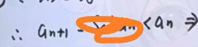
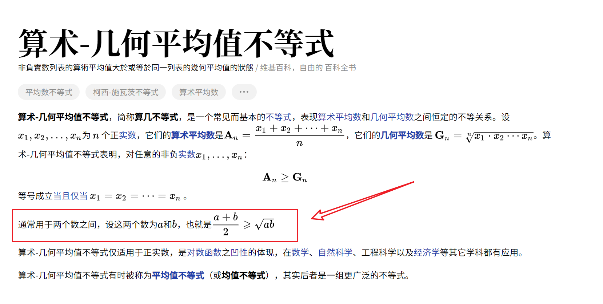
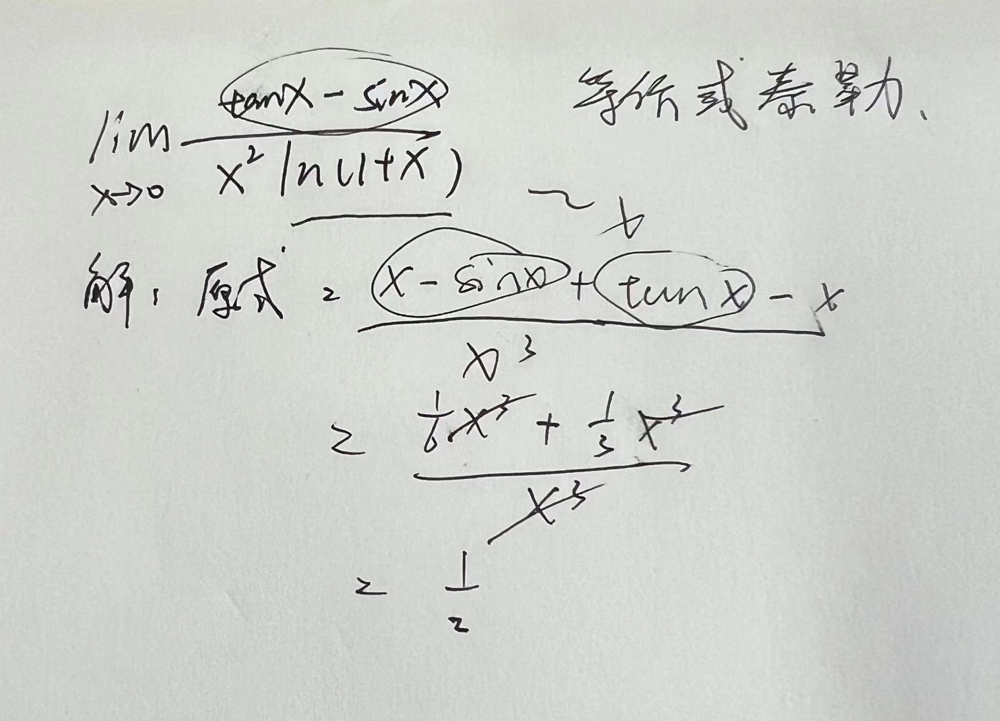
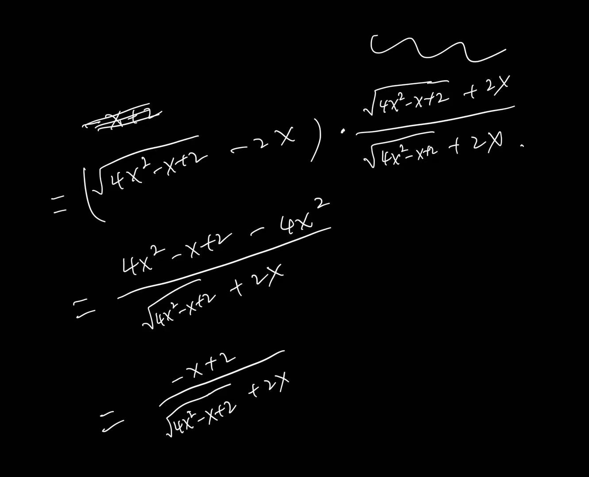
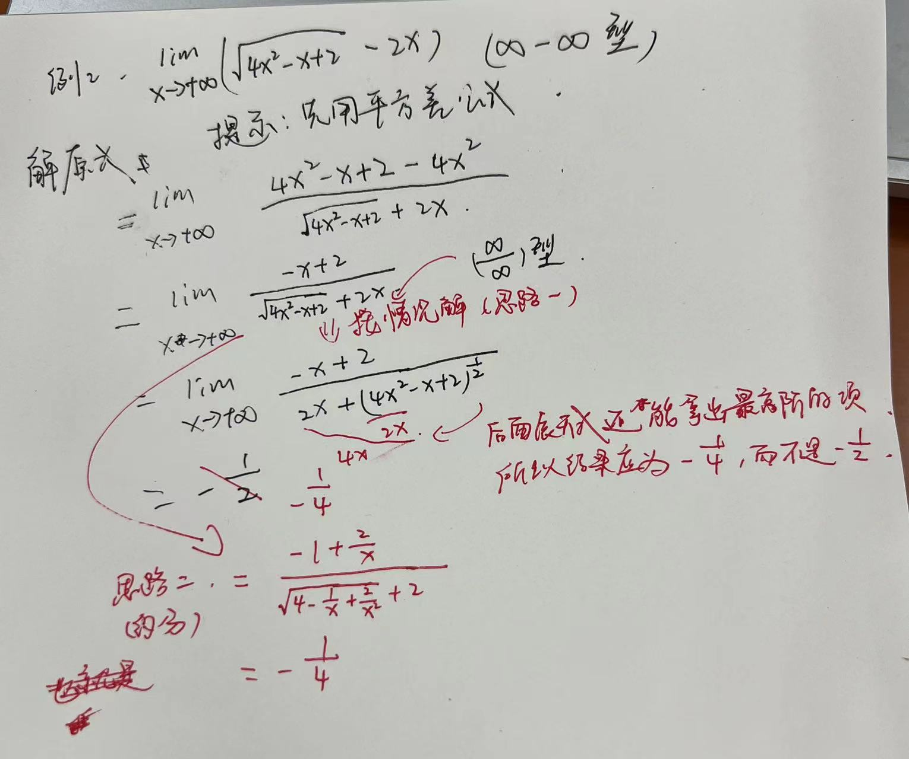

# 回顾

## 三角函数与反三角函数

> 解释一下 sec csc cot
> sec（secant）正割函数 --> 斜边比邻边
> csc（cosecant）余割函数 --> 斜边比对边
> cot（cotangent）余切函数 --> 邻边比对边

补充正弦函数图像：

# 1-极限与连续 ①

## 一. 定义

极限是无限接近的结果，这个结果可能永远达不到，是理想状态。例如：

所以说，函数在一个点的极限值跟函数在该点的函数值之间无关（可能函数表达式不同、可能不存在）

- 函数研究某点的极限函数跟在该点有没有定义没有关系，因为 x 取不到该点

[几何平均数 - 维基百科](https://www.wikiwand.com/zh-hans/%E5%87%A0%E4%BD%95%E5%B9%B3%E5%9D%87%E6%95%B0)

[算术-几何平均值不等式 - 维基百科](https://www.wikiwand.com/zh-hans/%E7%AE%97%E6%9C%AF-%E5%87%A0%E4%BD%95%E5%B9%B3%E5%9D%87%E5%80%BC%E4%B8%8D%E7%AD%89%E5%BC%8F)

[均值不等式\_百度百科](https://baike.baidu.com/item/%E5%9D%87%E5%80%BC%E4%B8%8D%E7%AD%89%E5%BC%8F/8046796)

ξ 取值不同，δ 取值也会改变，它们是对应关系

[常用数学符号 markdown 语法](学习日报/Day/2023-11-21.md#常用数学符号%20markdown%20语法)

[指数函数 - 维基百科](https://www.wikiwand.com/zh-hans/%E6%8C%87%E6%95%B0%E5%87%BD%E6%95%B0)

> 指数函数的底数大于 1 和大于 0 小于 1 的底数，图像相反

举个例子

 因为没有影响

[为什么要有邻域？](学习日报/Day/2023-11-21.md#为什么要有邻域？)

无穷小是指当一个变量趋近于某个特定值时，与该值的差趋近于 0 的量

[0是无穷小吗？那负无穷是什么？](学习日报/Day/2023-11-21.md#0是无穷小吗？那负无穷是什么？)

Notes
1. 0 为与自变量趋向无关的无穷小
2. 函数型的无穷小，要根据 x 的趋向来判断
3. **无穷小不谈正负（这种情况下，谈论两个无穷小相减的情况就失去意义了）**

## 二. 性质

### (一) 基本性质

- 唯一性
- 保号性
- 有界性

这里 ε 是任意取值的

[极限与连续中怎么理解有界性](学习日报/Day/2023-11-21.md#极限与连续中怎么理解有介性)

### (二) 存在性质

#### 准则 I（夹逼定理）

> 下面情况讲的是数列，不是函数

 #重大考点 

$为什么2^n=(1+1)^n=C^0_n+C^1_n+C^2_n+...+C^n_n$ --> [答案](学习日报/Day/2023-11-21.md#为什么2%20n%201%201%20n%20C%200_n%20C%201_n%20C%202_n%20C%20n_n)

> 疑问：为什么 0＜x ≤1 时，选取 $x^n$ 做分析，而 x ＞1 时，选取 $x^{2n}$ 做分析，为什么不一起分析或选取相反着来分析
> 
>  回答上面疑问：首先夹逼准则的左右两边极限值由我们自己界定，要根据 x 的取值范围来确定夹逼的左右极限值，根据指数函数的性质，当 x ＞1 时，$x^n+x^{2n} ≥ 2x^n ≥ x^{n}$ 不满足夹逼准则的格式，所以 $x^n$ 不合适用来分析 x ＞1 的结果，故选取 $x^{2n}$ 作为猜想值分析；同理，当 0＜x ≤1 时，$x^n+x^{2n} ≥ 2x^{2n} ≥ x^{2n}$ 不满足夹逼准则的格式（==注：x 在这一题目中只是一个未确定的常数值，真正的自变量只有 n，要根据题干确定自变量==）
>  
>  **技巧一**：我们基于 x 的取值判断夹逼左右极限值时，通常留下==较大值==进行分析，大概率能成功夹逼
>  
>  分析问题时，我们可以借助题目所给的函数类型图像、性质等进行猜想分析

Case1：分子、分母次数至少有一个不齐（夹逼定理解决）
常数为零次齐
[极限与连续中，怎么判断分子、分母的齐次数是多少](学习日报/Day/2023-11-21.md#极限与连续中，怎么判断分子、分母的齐次数是多少)

Case2：分子、分母齐次，且分母比分子多一次
参考：[高数求极限，夹逼定理与积分方法选择中，分子分母次数齐与不齐的判断\_百度知道](https://zhidao.baidu.com/question/877683764184809812.html)（夹逼定理与积分的选择口诀是：不齐夹逼齐定积。）
分子分母齐不齐，看每一项的幂次数是否相同，相同则齐

> 这是关于定积分与极限的黎曼和的极限的一个极限转换的证明。这里的表达式描述了一个极限情况下黎曼和与定积分之间的关系。
>
> 所给的式子表示了当 n 趋向无穷大时，n 个等距离点所对应的函数值 f((i-1)/n) 与定积分 \(\int_0^1 f(x) \,dx\) 之间的关系。具体来说，这个表达式表示当将区间 [0,1] 分成 n 等份，每个子区间的宽度为 \(1/n\) 时，函数 f(x) 在这些子区间中的和与函数在整个区间 [0,1] 上的积分之间的关系。
>
> 为什么可以省略掉 1/n 呢？这是因为在当 n 趋向无穷大时，随着 n 的增大，每个子区间的宽度 \(1/n\) 趋近于 0。这意味着当 n 很大时，每个子区间的宽度可以视为无穷小，接近于无穷小的极限。因此，可以在极限运算中将 \(1/n\) 视为无穷小，并将其省略。
>
> 通过这种极限转换，黎曼和的极限可以表示为定积分 \(\int_0^1 f(x) \,dx\)，因为每个子区间的宽度趋近于零时，n 个子区间的和趋近于函数在整个区间上的积分。
>
> **但是这里不是用1/n乘每一项吗，如果是乘积一个无穷小，其结果不是会趋向无穷小，为什么能省略呢？，如果是1/n与其他项相加从而省略我就能理解，乘积的理解不了**
>
> ==对于给定的极限形式，考虑的是一个黎曼和的极限转换为定积分的情况。在这里，1/n 乘以每一项是对每个小矩形的宽度进行缩放，它们的高度分别是 f((i-1)/n)，这代表着在每个小区间内用 f((i-1)/n) 这个高度乘以宽度 1/n，构成一个小矩形的面积。==
>
> ==对于每一项 1/n * f((i-1)/n)，当 n 趋向无穷大时，确实每一项的乘积会趋向于零，因为它们确实是乘以无穷小来计算小矩形的面积。但是整个极限形式的意义在于当把所有这些小矩形的面积加和起来，即求和 Σ(i=1)^n (1/n * f((i-1)/n)) 时，它们的和却趋向于定积分的值。==
>
> 这种情况下，可以根据极限的性质和黎曼积分的定义，将极限与积分关联起来。当 n 趋向无穷大时，虽然每个小矩形的面积都趋向于零，但是所有小矩形的面积加和在足够大的 n 下会趋向于定积分的值，即 $\int^1_0f(x)dx$。
>
> 因此，虽然乘积的每一项在极限情况下趋向于零，但是整个极限形式代表的是随着 n 趋向无穷大时总和的趋近行为，最终等于定积分的值。

$\frac{1}{1+x^2}$ 是 arctanx 的求导

#### 准则 II 单调有界的数列必有极限

Notes：
- {$a_n$ } 有界 <=> 有上、下界（充要条件）
- 下图上/下箭头表示单调递增/递减

##### 证明所涉及的不等式

- 
-  #重大考点 
- 
- 

> 以上三个不等式是我们证明数列极限存在非常常用的三个不等式

> 因为 极限与连续 ① 和 ② 课程内容重复（收集者收集失误，两个版本同个知识点讲解），故补充到 ① 中，note 章节名称与网课名称同步

# 1-极限与连续 ③

接上一章节

#重大考点

第二项开始值控制在 0~1 之间，也就是落在第一象限，且 n 越大值越小

- [x] 以下疑问问下奕迅 -- 2023-11-21 17:18 📅 2023-11-21 ✅ 2023-11-21

> 疑问：这里证明的第二步，为什么需要 $sina_n＜a_n$ 这个不等式来证明单调递减呢？不能通过{$a_n$}判断值在第一象限从而解释单调性吗？
> 
> 解答：主要是为了这一步
> 证明单调性需要证明 $a_{n+1}<a_n$

解释一下上图为什么能从 $a_{n+1}=sina_n$ => A=sinA，因为 n->∞ 所以 $a_{n+1}=sina_n 和  a_{n}$ 实际上没什么区别

回顾：[对数函数 - 维基百科](https://www.wikiwand.com/zh-hans/%E8%87%AA%E7%84%B6%E5%B0%8D%E6%95%B8)

之前是采用不等式图像转换来证明单调性，同时除了作差还有作商的形式来证明单调性
例 3 中第一步的 $a_n+\frac{1}{a_n}≥2$ 需要进一步证明
利用均值不等式

### (三) 无穷小的性质

#### 一般性质

#### 等价性质

也就是 x 趋于无穷小时：
① 中前 5 个函数随便哪二个相减结果为 3 阶
^b07fsb

- [ ] 等价无穷小的式子要背诵（成功默认 3 遍后关闭任务 3 个工作日） ➕ 2023-11-22 📅 2023-11-26

[等价无穷小](https://zhidao.baidu.com/search?word=%E7%AD%89%E4%BB%B7%E6%97%A0%E7%A9%B7%E5%B0%8F&fr=iknow_pc_qb_highlight)是无穷小的一种。在同一点上，这两个无穷小之比的极限为1，称这两个无穷小是等价的。等价无穷小也是[同阶无穷小](https://zhidao.baidu.com/search?word=%E5%90%8C%E9%98%B6%E6%97%A0%E7%A9%B7%E5%B0%8F&fr=iknow_pc_qb_highlight)。 从另一方面来说，等价无穷小也可以看成是[泰勒公式](https://zhidao.baidu.com/search?word=%E6%B3%B0%E5%8B%92%E5%85%AC%E5%BC%8F&fr=iknow_pc_qb_highlight)在零点展开到一阶的泰勒展开公式。

## 三. 重要极限

前提知识点：

> `1/2 x ab x sinC` 这个表达式表示了三角形的面积公式，其中 ab 是三角形两边的乘积，sinC 是夹角 C 的正弦值（这里是角度 非弧度喔），1/2 是面积公式的系数。
> 
> 这个式子的含义是：三角形的面积等于两边乘积的一半乘以夹角 C 的正弦值。这个公式通常用于求解三角形的面积，但它并不是传统的正弦定理的形式。
> 
> 圆的扇形面积公式：S 扇=（lR）/2 （l 为[扇形弧长](https://baike.baidu.com/item/%E6%89%87%E5%BD%A2%E5%BC%A7%E9%95%BF/5762301?fromModule=lemma_inlink)） =(1/2)θR²(θ为以弧度表示的圆心角)。

### 不定型
#重大考点

变换请见：[当 x→0 时，常用的等价无穷小](数学二/高等数学/基础/note.md#^b07fsb)

详细见：新增等价无穷小：
- $x-sinx$ ~ $\frac{x^3}{6}$
- $arcsinx-x$ ~ $\frac{x^3}{6}$
- $x-ln(1+x)$ ~ $\frac{x^2}{2}$
- $tanx-x$ ~ $\frac{x^3}{3}$
- $x-arctanx$ ~ $\frac{x^3}{3}$  
- $lim_{x \to 0}\frac{sinx}{x}=1$
- $lim_{x \to 0}(1+x)^{\frac{1}{x}}=e$ ^4b839b

^219k2m
- [ ] 做下等价无穷小转换的专项训练 ➕ 2023-11-23 📅 2023-11-24

所以我们考虑转化问题时，不能只考虑等价无穷小能进行转化就行，同时还要注意精确度的问题，==所以子项相乘，等价无穷小可任意转化，而子项相加，精确度要优先考虑==，上面那道题需要这么做

#### 0/0 型

例如下面子项相乘，等价无穷小任意替换

上一步式子变换到下一步，经历了分子分母约分，cosx+1 构建成 cosx-1 等，仔细看看就知道了

有的题型并不是所有子项都要进行等价无穷小的转换，有的不需要转换可直接计算结果（转换了反而不好计算结果）

补充：tanx(1-cosx)/x^3

- [ ] 做一下不定式的anki卡片（7种），方便复习（例如 0/0的三种情况） ➕ 2023-11-24 📅 2023-11-26

[参考等价无穷小公式](数学二/高等数学/基础/note.md#^219k2m)

 

- [x] 回顾洛必达法则 ➕ 2023-11-22 📅 2023-11-22 ✅ 2023-11-22

[求 lim(x->0)的式子中，可以使用洛必达法则对子项进行求导计算吗？这样结果不会有影响吗？](学习日报/Day/2023-11-22.md#求%20lim%20x-%200%20的式子中，可以使用洛必达法则对子项进行求导计算吗？这样结果不会有影响吗？)

[洛必达法则 - 维基百科](https://www.wikiwand.com/zh-hans/%E6%B4%9B%E5%BF%85%E8%BE%BE%E6%B3%95%E5%88%99)

#### $1^∞$ 型

> 很重要的一句话：当  $lim_{x \to 0}$ $(1+x)^{1/x}$ 或者 当 $lim_{x \to ∞}$ $(1+ \frac{1}{x})^x$  结果为 e

> 对于 A - B 型的极限，A 替换后为 a（A ~ a），B ~ b，若 a/b ≠ 1，则可以使用等价代换。
> 
> 对于 A + B 型的极限，A 替换后为 a（A ~ a），B ~ b，若 a/b ≠ -1，则可以使用等价代换。
> 
> 其实也就是等价替换后的和不为零，可以继续运算就行

#### $\frac{\infty}{\infty}$ 型

上图有误，是对数函数比幂函数，同时幂函数速度比对数函数快

好题

$lim_{n \to \infty}(n+1)^a-n^a$ 的值是无穷大吗？是的，[详细答案见这](学习日报/Day/2023-11-24.md#lim_%20n%20to%20infty%20n%201%20a-n%20a%20的值是无穷大吗？)
  
$C^0_a$ =1

- [ ] 幂函数展开式公式需要学一下 ➕ 2023-11-24 📅 2023-11-26

回顾一下

#### $0×\infty$ 型

#### $\infty - \infty$ 型

> 基础阶段掌握两种情况：有分母的和没有分母的

[等价无穷小公式](#^4b839b)

##### 没有分母的情况

具体化简步骤如下所示：

因为趋于无穷是可以这么做的（抓大放小）理解一下就懂了，追及无穷的速度反映在阶次数（不建议这么做，这种解法并没那么通用，按 ∞/∞ 型的情况解或进行约分解都行）

##### 有分母的情况

> 有分母需要先通分

回顾：arcsinx 图像 

> 加减法的等价无穷小需要注意精确度的问题

> 回顾：arcsinx 和 arctanx 的求导值
> 
> $\frac{d}{dx}arcsin(x)=\frac{1}{\sqrt{1-x^2}}$
> 
> $\frac{d}{dx}arctan(x)=\frac{1}{1+x^2}$

#### $\infty^0$ 和 $0^0$ 型

lnx^x 趋于0+极限等于0，以下是证明过程

$lim_{x \to 0^+}e^{lnx^x}=1$

- [ ] 总结 5 种不定型在什么样的条件(题型)进行运用并相互转换，之后通过习题巩固 ➕ 2023-11-23 📅 2023-11-26
- [ ] 温习不定型卡片和等价无穷小公式卡片📅 2023-11-26 

# 1-连续与间断 ④

> 相比连续，间断是考试的重点

> 间断是不连续的，即取不到的点，比如使分母为 0 的点、ln(0)的点等等

② **第二类间断点：f(a-0)、f(a+0) 至少一个不存在** #重大考点 

> 回顾：正切函数是奇函数，这里有个性质：
> 
> $tan(-x) = -tan(x)$
> $arctan(-x) = -arctan(x)$

x -> -1 左右极限都存在，推断该点为可去间断点，只是 f(x)在该点的极限≠f(-1)

> arctan(−1)的角度为 -π/4

x 趋于 2 这个点可代入原式，然后只需要分析 $arctan\frac{1}{x-2}$ 的左极限和右极限（因为他们计算结果分别对应 arctan-∞ 和 arctan∞，下图中有 arctan 图像，可看到在±∞对应的值分别为 ±π/2 ）计算得出左右极限结果不同，故 f(x=2)这个点为跳跃间断点

> 回顾：

除非加前提条件，f(x)的值都大于 0 同时 [a,b] 在第一象限
第三点为零点定理（讲义 P13 有说明），零点至少有一点，可能不止

- [ ] 复盘第一章极限与连续，并做题巩固（有宿舍拿草稿纸和笔），讲义习题集有需要可以先买 ➕ 2023-11-23 📅 2023-11-23
- [ ] 买个雷蛇 v2 侧裙防汗贴（旧的脱胶断裂了）和手纸 ➕ 2023-11-24

# 2-导数与微分 ①

## 一、定义

### 一阶导数

导数有两个等价定义，如下图所示

上面列举了两种求微分的方式，下图用的第一种方式

左右导数不等说明函数在该点不连续，（补充：上图描述中讲到“跟直接求导数是等价的”，这句话是没错，但有时候我们想要求的点并不一定能直接取到，例如使分母为 0 的点，这是我们要通过判断左右极限的方式来进行计算结果判断是否有解）

> **温习一下：如何判断是否可导？**
> 
> 函数在点 x=a 处可导，如果下面的极限存在：
> 
> $f'(a)=lim_{h \to 0}\frac{f(a+h)-f(a)}{h}$
> 
> 如果该极限存在且有一个有限的值，那么函数在 x=a 处是可导的。

如果 $lim_{x->a}\frac{f(x)-f(a)}{x-a}$ 存在，则推出 $lim_{x->a}f(x)=f(a)$。为什么？
>  [连续指的是函数值连续吗？](学习日报/Day/2023-11-26.md#连续指的是函数值连续吗？)
>  
>  因为可导一定连续，连续的话函数值需要相同 [详细答案](学习日报/Day/2023-11-26.md#如果%20lim_%20x-%20a%20frac%20f%20x%20-f%20a%20x-a%20存在，则推出%20lim_%20x-%20a%20f%20x%20f%20a%20。为什么？)
>  
>  [柯西中值定理 - 维基百科](https://www.wikiwand.com/zh-hans/%E6%9F%AF%E8%A5%BF%E4%B8%AD%E5%80%BC%E5%AE%9A%E7%90%86)

像 上图中的 f(x) =2x+|x| ，虽然连续，但左右极限不等，故不可导

所以，连续不一定可导，可导一定连续

运用到了注解 ①

⑤ 设函数 f(x) 可导，若 f(x) 为奇函数，则 f'(x) 为偶函数；若 f(x) 为偶函数，则 f'(x) 为奇函数

### 高阶导数

> 讲义 P35

### 可微

>  [可微和可导相差一个高阶无穷小0(:luc_triangle:x)(详细解释)](学习日报/Day/2023-11-26.md#可微和可导相差一个高阶无穷小%20详细解释)
>  
>  连续>可微>可导，（可导的条件更加严苛，可导说明连续且可微）

[可微和可导的区别](学习日报/Day/2023-11-25.md#可微和可导的区别)

[可导一定可微，可微一定可导“ 这句话对吗](学习日报/Day/2023-11-25.md#”可导一定可微，可微一定可导“%20这句话对吗)

[高阶无穷小\_百度百科](https://baike.baidu.com/item/%E9%AB%98%E9%98%B6%E6%97%A0%E7%A9%B7%E5%B0%8F/1980915)（若 lim(β/α)=0，则称“β是比α较高阶的无穷小”。意思是在某一过程(x→x0或 x→∞这类过程)中，β→0比α→0快一些 [1]  。补充：而如果α比β快的话，那么 lim(β/α)=∞，这也很好理解，因为α作为分母越小，值越趋于无穷大）

[可导的定义是什么](学习日报/Day/2023-11-25.md#可导的定义是什么)

下面是上图 ① 的证明过程

## 二、求导四大工具

### (一) 求导的基本公式

> 重点，讲义 P36，要熟练背诵的

- [x] 背诵求导以及求微分的基本公式，做个简易anki卡片 ➕ 2023-11-25 📅 2023-11-28 ✅ 2023-11-26

> 凡事汤老师没列出来的知识点，都是属于强化阶段的部分，基础阶段不建议先学，先把基础打好先

### (二) 四则求导法则

> 汤老师的零基础视频中有证明四则求导法则的由来，可以看一遍

### (三) 复合函数的求导法则

> 复合函数也就是嵌套关系

φ’(x) = 0 , 说明是常数级的

> **y=f(u)可导，u=φ(x)可导，φ’(x) =0，不能推断出 y=f(φ(x)) 可导吗？举个例子帮助我理解**
> 
> 这个例子说明了即使两个函数都是可导的，但合成函数可能不是可导的，尤其是当内部函数的导数在某些点上为零，导致函数不光滑或不严格单调时。

说明△u 和△x 是同阶无穷小（上面写的不好，误以为是高阶无穷小），同时待会余下证明过程也可以进行相互转换替换，因为他们是同阶无穷小
 

### (四) 反函数求导法则

> 再强调一点，大学的反函数 xy 不能对调，只需求出 x 的表达式就是反函数
> 
> 函数与反函数的导数互为倒数
> 
> [为什么反函数的导数等于原函数导数的倒数？ - 知乎](https://www.zhihu.com/question/308529121)
> 
> $y=x^3 和 x=y^{\frac{1}{3}}$ 的导数是否互为倒数？[是的，详情见这](学习日报/Day/2023-11-26.md#y%20x%203%20和%20x%20y%20frac%201%203%20的导数是否互为倒数？)

同阶无穷小可相互替换

### 求导的类型

#### （一）定义研究导数

#### （二）显函数求导

> 主要是基本功扎实就行

> 小结：快速把导数和微分系列视频看完复盘，这两天学得并不好，效率较低

# 2-导数与微分 ②

### 三、隐函数求导

> 求导时，不要把 y 单纯看成 y，而是看成 y 关于 x 的函数

隐函数求导中，$(y^2)'$ 为什么等于 $2y\frac{dy}{dx}$？ [答案在这](学习日报/Day/2023-11-27.md#隐函数求导中，%20y%202%20'%20 为什么等于%202y%20frac%20dy%20dx)

上面例题 1 和 2 求导数通式，下面例题 3 求某点的导数

> 例题 3 题型总结
> 题干给出隐函数关系式，求某一点的导数
> 1. 先代入 x 值求对应的 y 值
> 2. 关系式两边同时求导，求出包含 dy/dx 的关系式
> 3. 代入在该点的 x 值和 y 值求 dy/dx，也就是 y'(x) 求导数值

## 四、参数方程确定的函数求导

> 汤老师写的注解前带 `th` 的是定理的意思

> 构建参数方程是因为 x 和 y 没有直接关系，而他们都与 t 有关系，所以通过 t 来搭建桥梁来求 dy/dx

注意求导的对象，是 dy/dx，还是 dy/dt，这很重要，上面例题 1 解题过程看讲义比较明朗

> 题型归纳：求参数方程确认的函数的二阶求导
> 1. 先拆分 $\frac{d^2y}{dx^2}$ 为 $\frac{d}{dx} · \frac{dy}{dx}$ ，求 dy/dx
> 2. 分子分母再同时除以 dt，构建 dt 的二阶求导即可

## 五、分段函数求导

> 一个重要的点是，先看是否连续，连续再看是否可导

 第三步骤是求 f(x) 在 x=0 点是否可导（可导说明在该点附近的曲线光滑有斜率，然后因为 f(0)是在 sin2x/x 中是取不到的点，所以要进行微分单独计算才能知道情况）

> 小结：如果是非间断点，则用求导公式 dy/dx 直接计算，如果是间断点，则用求导的基本定义公式进行计算

 

[可导跟极限存在是什么关系](学习日报/Day/2023-11-26.md#可导跟极限存在是什么关系)（可导的形成条件比极限存在更严苛）

## 六、高阶导数

> 不是基础阶段的重点，高阶导数主要运用**归纳法**
> 
> 根据三角函数的和角公式
> $sin(\alpha)+cos(\alpha)=\sqrt{2}·sin(\alpha+\frac{\pi}{4})$

- [x] 把通式制作成 anki 卡片背诵起来  📅 2023-11-27 ✅ 2023-11-27

> 题型归纳，如果求高阶导数有分母的情况，则尝试是否能化简到高阶 n 次通式的格式，然后直接代入公式求解 

# 3-一元函数微分学的应用

## 3.1 中值定理

### 预备知识

极大点极小点统称极值点，极大值极小值统称为极值

 

但结论①和②不能反推回原条件，可能是极值点，但不一定是
反例论证：

极值点是驻点的一种特殊情况

[驻点和极值点有什么联系与区别](学习日报/Day/2023-11-28.md#驻点和极值点有什么联系与区别)

### 罗尔中值定理

> 在给定闭区间内，连续且在开区间可导，同时区间两端的值相等

这里结论存在 δ 属于 （a，b），不包含 a 和 b 端点是因为条件②只说明在开区间内可导，所以 a 和 b 端点可能为不可导点

- [x] 📅 2023-11-29 罗尔定理的证明要会写（考试是有可能出现的）同时记录到 anki 卡片中，方便回顾 ✅ 2023-11-29

> 小结：说一下上述罗尔定理的证明思路
> 1. 根据 f(x) 在闭区间内连续推出存在最小值 m 和最大值 M（运用条件①）
> 2. 对 m 和 M 的值大小进行判断分析（m=M 和 m<M）
> 	1. m=M，推出 f(x)为常数项，开区间内处处导数为 0
> 	2. m<M，根据条件③，判断最大值或最小值至少有一点在开区间内取到（此时将出现极小值或极大值）
> 	3. 设置 f(δ)=M，推出 f'(δ)=0 或不存在
> 	4. 根据条件②，推出结论： f'(δ)=0
> 
> 补充：x=a 为极值点 => f'(x)=0 或 f'(x)不存在

> f(x)属于 c[a,b]，不能直接推出区间存在 f'(x)=0的点，需要再加上闭区间的两个端点处函数值相等才可（罗尔定理）

> 由于罗尔定理由于第三个形成条件受限大，故后续提出拉格朗日中值定理

### 拉格朗日中值定理

点斜式直线方程

> 点斜式是直线方程的一种表达形式，它使用直线上的一个点和直线的斜率来表示直线方程
> 
> 点斜式的一般形式可以表示为：$y−y1​=K(x−x1​)$

分析拉格朗日中值定理：

> 拉格朗日中值定理比如麻烦的是辅助函数的构造

证明拉格朗日中值定理：

> 说明：加减乘是不改变函数连续性的，除有可能改变
> 闭区间上保证连续性，开区间上保证可导性

> 所以罗尔定理是拉格朗日定理的一种特殊情况，属于被包含的关系

下图恒等于的前提条件是开区间(a<x<b)
上面结论写 f(x) = f(a) 等价于 $C_0$ ，写 f(a)的意义是让其知道 f(x) 等价于 f(a) 的值 $C_0$

> 可导性不包含端点

### 柯西中值定理

请注意：f(b)-f(a)与 g(b)-g(a) 的 δ  不一定相等，同时前提条件③ g'(x) ≠ 0，是为让结论中分母都不为 0 

[柯西中值定理中，结论 f'(δ)/g'(δ) 这里两个δ是指同一个吗](学习日报/Day/2023-11-29.md#柯西中值定理中，结论%20f'%20δ%20g'%20δ%20 这里两个δ是指同一个吗)（强调：柯西定理只确保在某一个区间内，至少在一个点 δ 处，使其上图结论的比值相同，也可能存在其他不同δ使其比值相同，但这不是我们柯西定理要讨论的范围）

因为 g'(x) 导数为 1，分母变为 1

> 罗尔定理包含在拉格朗日定理中，而拉格朗日定理又包含在柯西定理中（因为 g(x)可以取多种情况，g(x)=x 只是其中一种情况）
> 
> 补充：汤老师单独写一个 L，是代表拉格朗日定理

分析柯西中值定理

注意：f(x)是光滑曲线，g(x)是直线，在下图中（因为我们前面已设定 g(x)=x）

[柯西定理中，f(x)与 g(x)需要过相同的端点吗](学习日报/Day/2023-11-29.md#柯西定理中，f%20x%20与%20g%20x%20需要过相同的端点吗)

> 思路梳理：柯西中值定理的证明跟拉格朗日大同小异，最终都是转化成符号罗尔定理的情况，先把前提条件列出，最后推出 φ'(δ)=0 ，推导出定理对应的结论

> 初心：所有类型的中值定理都是为了判断某指定区间内是否有极值点，有的话会出现怎样的特性
> 
> 汤老师用 then 是表示 “则”、“所以”的意思，th 表示定理（theorem）

### 洛必达法则

> 讲义 P55

#### 法则一

研究 x=a 点的极限压根取不到这个 a 点，所以说去心邻域，a 点情况如何跟我没有任何关系  

#### 法则二

### 泰勒中值定理

背景

> 纠正一下，两种余项名词分别为，拉格朗日型余项 和 佩亚诺型余项

Pn(x)中好像懂了，每一项都是由导数×dx（也就是 dy），n 阶导就是 $f^{n}(x_0)×dx^n$ 所以是$（x-x_0）^n$ 然后每一项求导，系数会累计乘（变成 n 的阶乘），需要乘对应分母进行约分（**但到了这，我又有了疑惑，为什么要约分呢？这不是求导的结果吗？** 阶乘是求导产生的结果，如果要近似目标函数，需要约分掉，否则影响多项式累积和（影响近似度））

> 下面是泰勒公式系数的推导，帮助其理解
> 
> [10-泰勒级数](数学二/高等数学/微积分的本质--3Blue1Brown.md#10-泰勒级数)
> 
> [泰勒公式推导笔记](https://blog.bill.moe/taylor-series-notes/) 

> （泰勒公式）多项式越多，与 f(x) 的图像越接近（某点/某区域），但复杂度也越高

[什么是有理数](学习日报/Day/2023-11-29.md#什么是有理数)

> 补充一下：麦克劳林公式是泰勒公式在 $x_0=0$ 时的特殊情况
> 
> 

^f8a2c2

> 不仅系数代入，x 的取值有改变也代入

# 3-一元函数微分学的应用 ③

## 3.2 单调性与极值

### 一. 定义

### 二. 极值判断

 

极限的保号性好有用 

### 三. 其他问题

#### 凹凸性和拐点

该判别定理在基础阶段不做证明，强化阶段一定证

#### 渐近线

##### 定义

##### 水平渐近线

##### 铅直渐近线

##### 斜渐近线

但反之，间断点不一定产生铅直渐近线

如果 lim_{x -> ∞} y/x 没反应过来=1，就看讲义里面的答案，比较详细

 

#### 弧微分

这里 ds 称为弧元素，微分状态下等价于直角三角形
弧微分的基本公式

参数方程的弧微分基本公式

#### 曲率与曲率半径

注意：这里 y 的导数特指 y 对 x 的求导！

由曲率半径形成的圆叫曲率圆

> 补充一个小知识点，计算判断两条线是否垂直 

# 3-一元函数微分学的应用 ④

> 主要讲题型

## 第一部分 中值定理

### 题型一 证明 $f^{(n)}(δ)=0$

证二阶导数为 0 有两个思路
1. 找三个点证明拉格朗日定理从而证明罗尔定理
2. 找两个一阶导数为 0 的点证明罗尔定理

 

 

### 题型二 待证结论仅含一个中值δ，无 a,b

#### 还原法

 

> P63 例题三自己做

 

#### 分组法

 

零点定理用开区间

  

> P64、P65 还有很多没讲到的，所以先不管，这些没讲的属于强化阶段的部分

