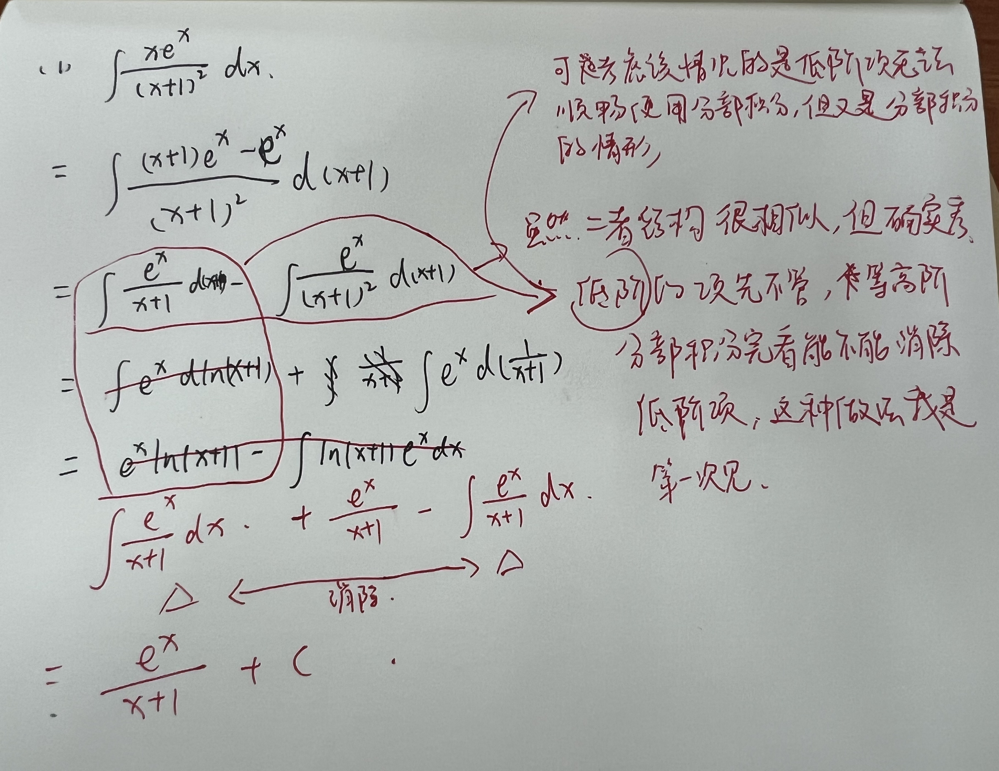

> 说明：
> 本错题集仅收集：
> - 难点知识点（难记忆 or 难理解）相关的错题
> - 反复出错的某一知识点或解题技巧（套路、固定公式模板）的错题
> - 有意思、灵活的题目
> 
> 注：如果题目涉及 Page x 则对应讲义的第 X 页

 

# 4-不定积分

P94 例题 3（1）

P94 例题 3（4）

P96 例题 2（1）

- [ ] P96 例题 2（3）不知道如何转换负数型的指数分数子项积分 📅 2023-12-13 

